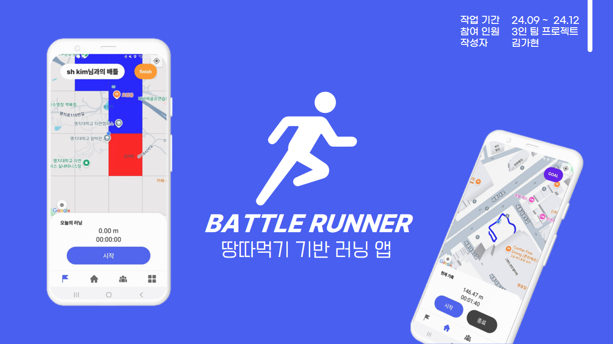
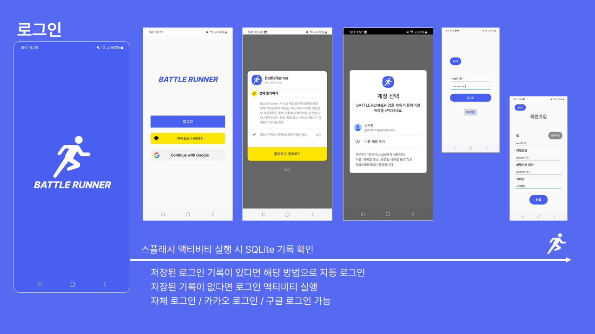
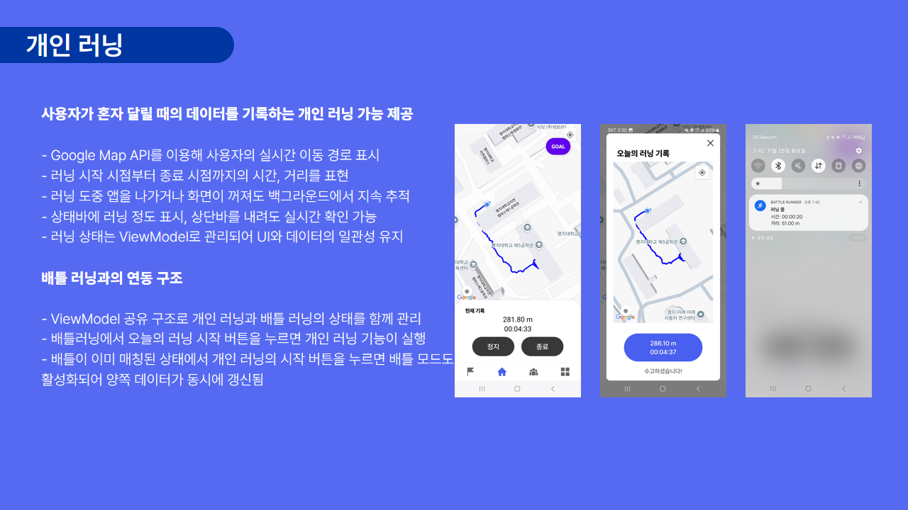
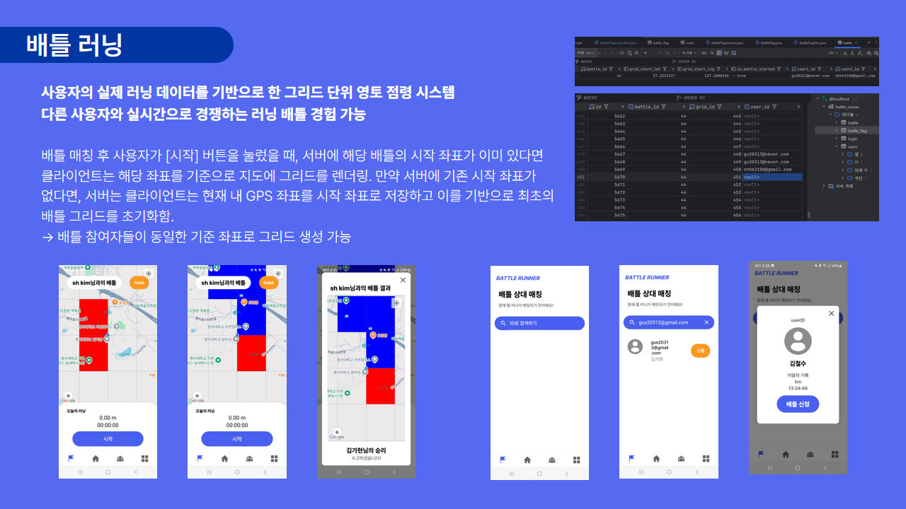
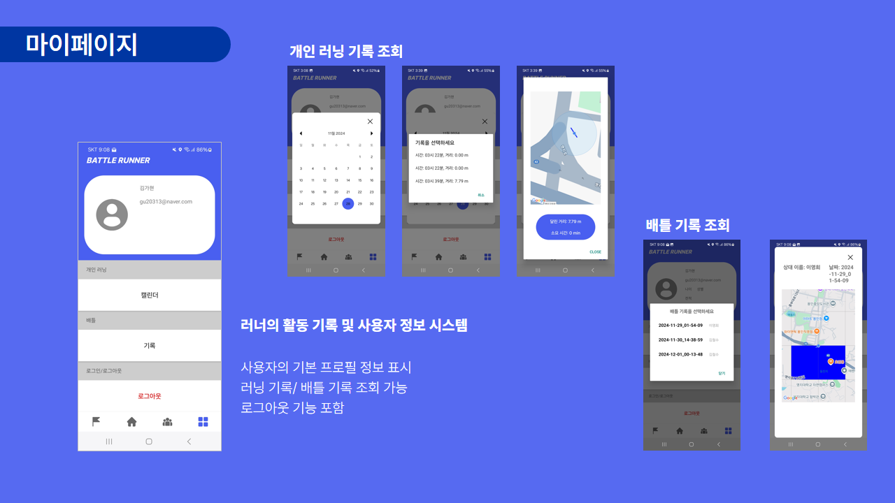
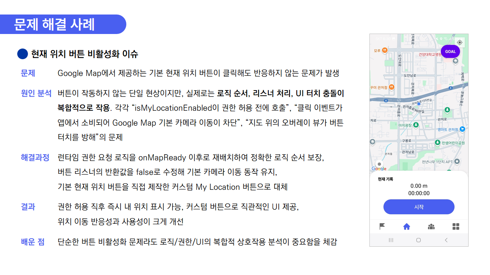
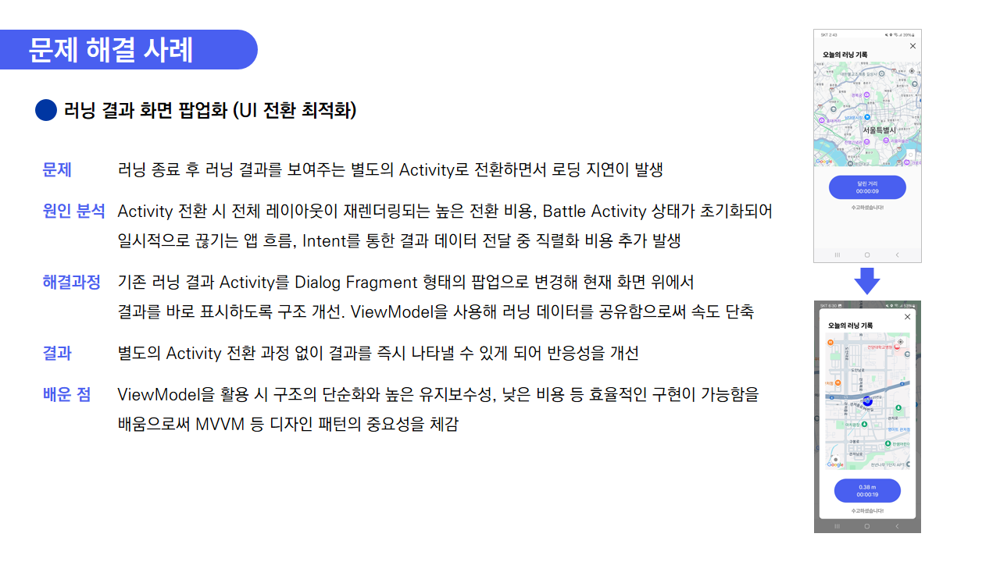
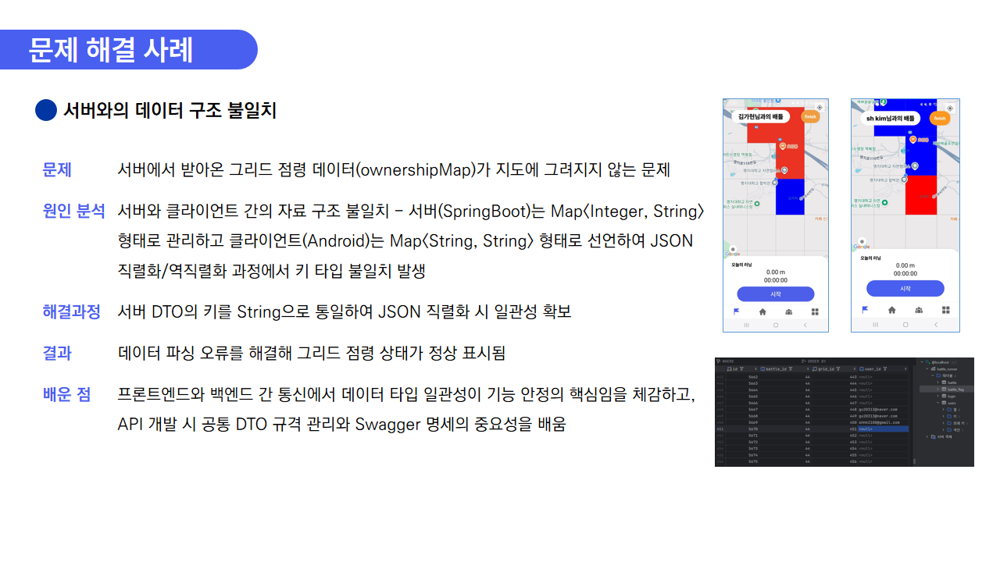
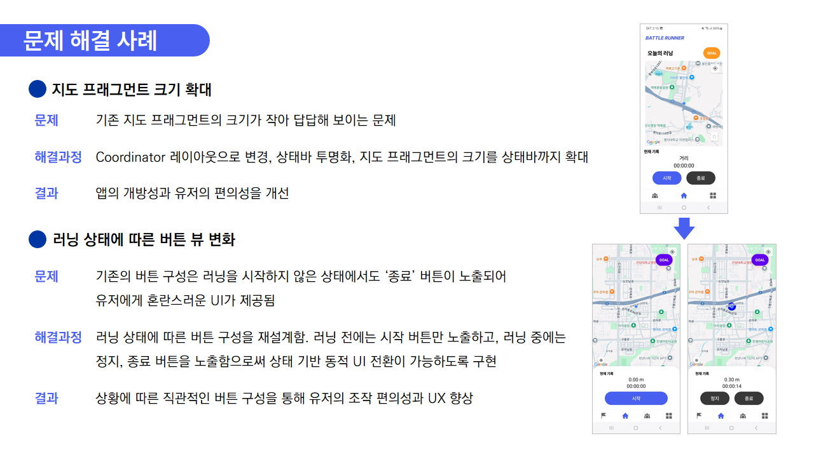
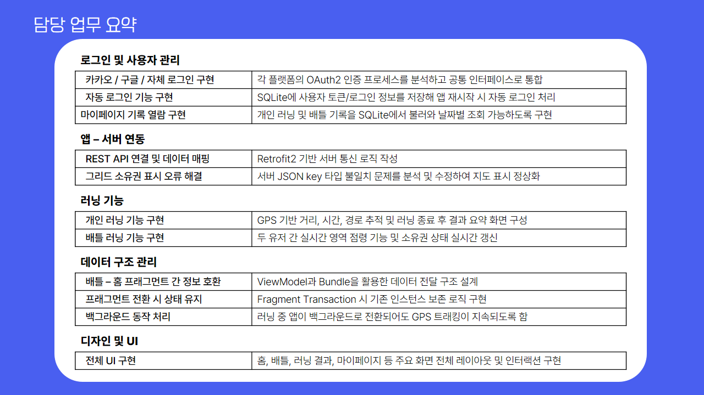

# 🏃‍♀️ 배틀러너

> **“땅따먹기 기반 러닝 배틀 앱”**  
> 혼자서! 둘이서! 러너를 위한 러닝 앱

 

## ⚙️ 기술 스택

### 📱 Android (Client)

| 구분 | 기술 | 설명 |
|------|------|------|
| **언어 / 구조** | `Kotlin`, `MVVM`, `ViewModel`, `LiveData`, `ViewBinding` | 구조적 상태 관리 및 UI 자동 갱신 |
| **지도 / 위치 추적** | `Google Maps SDK`, `FusedLocationProviderClient`, `Polyline`, `Marker` | GPS 기반 실시간 위치 추적 및 경로 표시 |
| **네트워크 통신** | `Retrofit2`, `OkHttp3`, `Gson`, `Coroutine` | 서버와 비동기 REST API 통신 |
| **로컬 데이터 저장** | `SQLite`, `DBHelper`, `SharedPreferences` | 자동 로그인 / 러닝 기록 로컬 저장 |
| **백그라운드 서비스** | `Foreground Service`, `NotificationManager` | 러닝 중 거리·시간 실시간 표시 |
| **기타** | `Logcat`, `Gradle`, `Google Play Services` | 디버깅, 빌드, 권한 관리 |

### 🌐 공통 / 협업 환경

| 구분 | 도구 | 설명 |
|------|------|------|
| **버전 관리** | `Git`, `GitHub` | 브랜치 전략 및 포트폴리오 공개 |
| **테스트 / 디버깅** | `Postman`, `Swagger UI`, `ADB Logcat` | API 검증 및 통신 점검 |
| **디자인 / 문서화** | `Figma`, `draw.io`, `Excalidraw` | UI 디자인 및 시스템 구조 다이어그램 제작 |

 
    
## ✨ 핵심 기능

| 기능 | 설명 | 
|------|------|
| 🗺️ **그리드 점령 시스템** | 250m x 250m 구역 단위로 영역 점령 |
| ⚔️ **실시간 배틀 매칭** | 두 사용자가 같은 지역에서 달리며 점령 경쟁 |
| 🔑 **로그인 / 자동로그인** | 자체, Google, Kakao 로그인 지원 | 
| 💾 **기록 저장** | 러닝/배틀 기록을 SQLite 및 로컬 서버(MySQL)에 저장 | 
| 📊 **결과 리포트** | 점령률, 거리, 시간 기반 결과 리포트 표시 | 

 

 

## 🧩 시스템 구조

| Android App | Spring Boot Server |
|--------------|-------------------|
| Kotlin (MVVM), XML, Retrofit, Google Maps | Spring Boot, JPA, MySQL, Swagger |
| SQLite 로컬 저장 | REST API 기반 데이터 통신 |
| 로그인/배틀/맵 관리 UI | Controller-Service-Entity 구조 |

 

## Problem Solving Example

| 현재 위치 버튼 비활성화 이슈 | 러닝 결과 화면 팝업화 |
|-------|-------|
|  |  |

| 서버와의 데이터 구조 불일치 | UI 개선 |
|-------|-------|
|  |  |

 

## ✨ 팀원 

| 김가현 | 김세현 | 황유석 |
|-------|-------|-------|
| FE, 기획, 디자인, BE | BE | FE |

 

## 나의 역할

