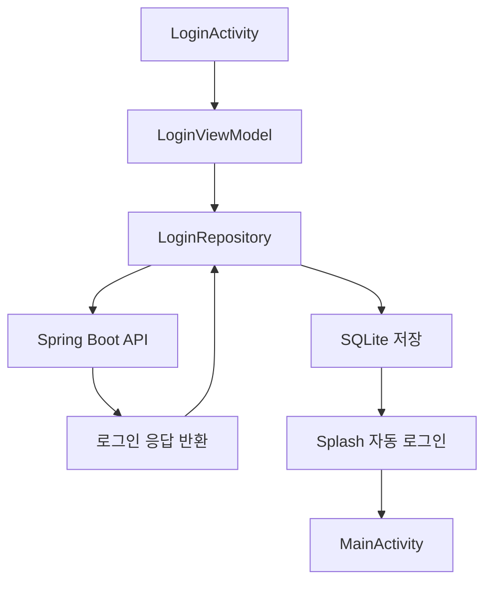
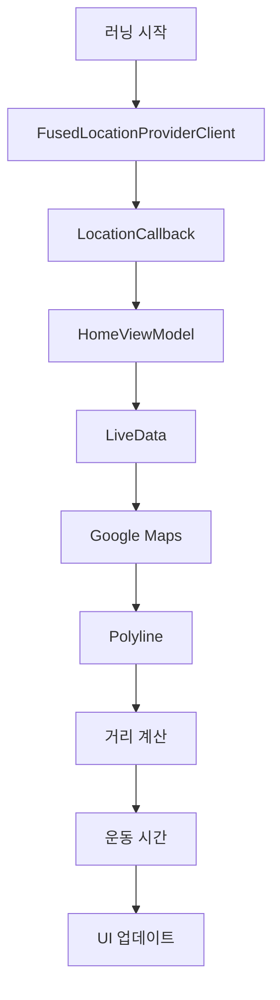
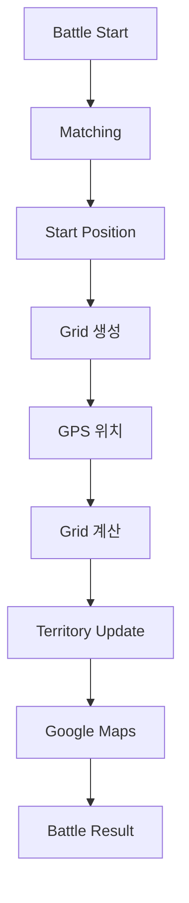
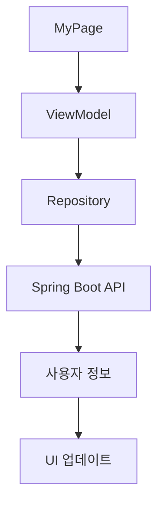
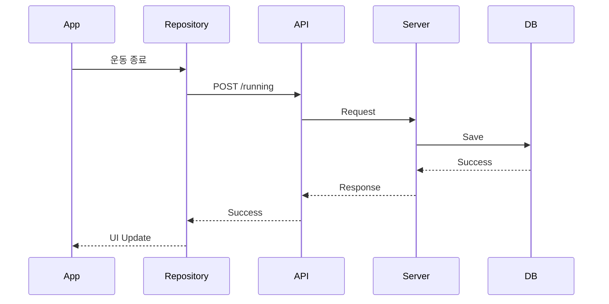
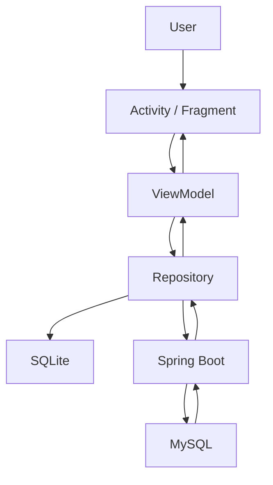

# 🏃 BattleRunner

<div align="center">


GPS 기반 실시간 러닝과 배틀 시스템을 제공하는 Android 애플리케이션

</div>

---

# 📖 프로젝트 소개

BattleRunner는 사용자의 러닝 기록을 단순히 저장하는 것을 넘어, **실시간 GPS 위치 추적**과 **배틀 시스템**을 결합한 Android 애플리케이션입니다.

Google Maps SDK를 활용하여 이동 경로를 지도 위에 실시간으로 시각화하고, 운동 시간과 이동 거리 등을 기록할 수 있도록 구현했습니다.

또한 두 명의 사용자가 동일한 기준 좌표에서 러닝을 진행하고 서로의 영역을 점령하는 Battle Mode를 구현하여 기존 러닝 애플리케이션과 차별화된 경험을 제공하도록 설계했습니다.

프로젝트는 MVVM 아키텍처를 기반으로 구현했으며 ViewModel을 이용하여 UI와 비즈니스 로직을 분리하고 유지보수성을 높였습니다.

---

# 📌 프로젝트 개요

| 항목 | 내용 |
|------|------|
| 프로젝트명 | BattleRunner |
| 개발 기간 | 2024.09 ~ 2024.12 |
| 개발 인원 | Android 2명 / Backend 1명 |
| 담당 | Android 앱 개발 |
| 개발 환경 | Android Studio, Kotlin |
| Architecture | MVVM |
| Backend | Spring Boot |
| Database | MySQL, SQLite |

---

# 👨‍💻 담당 기능

BattleRunner 프로젝트에서 Android 클라이언트 개발을 담당했습니다.

### 담당한 기능

- Splash 자동 로그인
- 자체 로그인
- Google 로그인
- Kakao 로그인
- SQLite 로그인 관리
- Google Maps
- GPS 위치 추적
- Polyline
- Timer
- 이동 거리 계산
- Battle Mode
- Grid Territory
- Retrofit 연동
- MVVM 설계
- Repository Pattern

### 제외한 기능

Directions API 기반 길 추천은 팀원이 구현을 담당했으며,
실제 서비스에서는 정상 동작하지 않아 핵심 기능에서는 제외했습니다.

---

# 🎯 개발 목적

기존 러닝 애플리케이션은 대부분 개인 운동 기록 관리에 초점을 맞추고 있습니다.

BattleRunner는 운동에 게임 요소를 접목하여 사용자의 지속적인 운동 참여를 유도하는 것을 목표로 개발되었습니다.

이를 위해 다음과 같은 기능을 구현했습니다.

- GPS 기반 실시간 위치 추적
- Google Map 이동 경로 표시
- 운동 시간 및 거리 계산
- 실시간 배틀 시스템
- 자동 로그인
- 러닝 기록 관리

---

# ⭐ 주요 기능

## 🔐 로그인

- 자체 로그인
- Google 로그인
- Kakao 로그인
- SQLite 기반 자동 로그인
- Splash 자동 로그인 처리

---

## 🏃 개인 러닝

- Google Maps SDK
- GPS 위치 추적
- Polyline 이동 경로 표시
- 실시간 운동 거리 계산
- 운동 시간 측정
- Background Tracking

---

## ⚔️ Battle Mode

- 사용자 매칭
- 동일 시작 좌표 생성
- Territory 시스템
- Grid 점령
- 결과 계산

---

## 👤 마이페이지

- 프로필 조회
- 러닝 기록 조회
- 배틀 기록 조회
- 로그아웃

---

# 🛠 Tech Stack

## Android

- Kotlin
- MVVM
- ViewBinding
- LiveData
- ViewModel
- Navigation Component

## Network

- Retrofit2
- OkHttp3
- Gson

## Map

- Google Maps SDK
- FusedLocationProviderClient

## Authentication

- Google Login
- Kakao Login

## Backend

- Spring Boot
- REST API

## Database

- SQLite
- MySQL

---

# 🤔 기술 선택 이유

BattleRunner는 실시간 위치 추적, 지도 기반 러닝 기록, Grid 기반 배틀 기능을 제공하는 Android 애플리케이션입니다. 기능 특성상 위치 데이터가 지속적으로 변경되고, 지도 UI와 서버 통신이 함께 동작해야 했기 때문에 유지보수성과 상태 관리가 중요하다고 판단했습니다.

---

## Kotlin

Kotlin은 Android 공식 개발 언어이며 Null Safety를 지원하여 런타임 오류를 줄일 수 있습니다.

BattleRunner에서는 GPS 위치 추적, Google Maps 연동, Retrofit API 통신, SQLite 데이터 관리 등 다양한 기능을 구현해야 했기 때문에 Java보다 간결하고 가독성이 좋은 Kotlin을 선택했습니다.

또한 `data class`를 활용해 서버 요청/응답 DTO를 간결하게 정의하고, ViewModel과 Repository 계층에서도 불필요한 보일러플레이트 코드를 줄일 수 있었습니다.

---

## MVVM Architecture

BattleRunner는 러닝 중 운동 시간, 이동 거리, 현재 위치, 경로 데이터가 지속적으로 변경되는 프로젝트입니다.

초기에는 Activity와 Fragment에서 많은 로직을 직접 처리했지만, 기능이 늘어나면서 화면 코드가 복잡해지고 상태 관리가 어려워지는 문제가 있었습니다.

이를 해결하기 위해 MVVM 아키텍처를 적용하여 UI와 비즈니스 로직을 분리했습니다.

ViewModel에서 로그인 상태, Timer, 이동 거리, 경로 좌표, Battle 상태 등을 관리하도록 구성하여 화면 회전이나 Fragment 재생성 상황에서도 데이터가 유지되도록 설계했습니다.

---

## Google Maps SDK

BattleRunner의 핵심 기능은 사용자의 러닝 경로를 지도 위에 실시간으로 시각화하는 것입니다.

Google Maps SDK를 사용하여 현재 위치 표시, Camera 이동, Polyline 기반 이동 경로 표시, Battle Grid 및 Territory 시각화를 구현했습니다.

지도 기반 서비스에서 안정적인 API와 Android 연동성을 제공하기 때문에 Google Maps SDK를 선택했습니다.

---

## FusedLocationProviderClient

러닝 앱에서는 위치 정확도와 배터리 효율이 모두 중요합니다.

FusedLocationProviderClient는 GPS, Wi-Fi, 기지국 정보를 함께 활용하여 위치를 제공하고, Android에서 권장하는 위치 제공 API이기 때문에 선택했습니다.

BattleRunner에서는 위치 업데이트를 받아 현재 위치를 표시하고, 이전 위치와 현재 위치 사이의 거리를 계산하며, Polyline과 Battle Grid 소유권 계산에 활용했습니다.

---

## LiveData

러닝 중에는 경과 시간, 이동 거리, 경로 좌표, 버튼 상태 등이 계속 변경됩니다.

LiveData를 사용하여 ViewModel의 상태 변화를 Fragment가 관찰하도록 구성했습니다.

이를 통해 UI가 직접 데이터를 관리하지 않고, 상태가 변경될 때 필요한 화면만 갱신되도록 구현했습니다.

---

## Retrofit

BattleRunner는 Spring Boot 서버와 REST API로 통신합니다.

Retrofit을 사용하여 로그인, 회원가입, 사용자 정보 조회, 배틀 생성, Grid 시작 좌표 저장, Grid 소유권 업데이트 등의 API를 선언형 인터페이스로 관리했습니다.

API 호출 코드를 Repository로 분리하기에도 적합하여, UI 계층이 네트워크 구현 세부사항에 직접 의존하지 않도록 만들 수 있었습니다.

---

## Repository Pattern

Repository Pattern은 ViewModel과 데이터 소스를 분리하기 위해 적용했습니다.

ViewModel은 Repository만 호출하고, Repository는 상황에 따라 Retrofit 또는 SQLite를 사용하여 데이터를 처리합니다.

이를 통해 UI 코드에서 서버 통신과 로컬 DB 접근 로직을 분리하고, 기능이 늘어나도 유지보수하기 쉬운 구조를 만들었습니다.

---

## SQLite

BattleRunner는 앱 재실행 시 자동 로그인을 지원해야 했습니다.

로그인 성공 후 사용자 ID, 비밀번호 또는 토큰, 사용자 이름, 로그인 타입을 SQLite에 저장하고, Splash 화면에서 저장된 로그인 정보를 조회하여 자동 로그인 여부를 판단하도록 구현했습니다.

또한 러닝 기록과 배틀 기록도 로컬 DB에 저장하여 마이페이지와 캘린더 화면에서 조회할 수 있도록 구성했습니다.

---

## Spring Boot

Android 앱에서 발생한 로그인, 사용자 정보, 러닝 기록, 배틀 데이터를 서버와 연동하기 위해 Spring Boot 기반 REST API를 사용했습니다.

클라이언트는 Retrofit으로 서버 API를 호출하고, 서버는 MySQL에 데이터를 저장하는 구조로 역할을 분리했습니다.

이를 통해 Android 앱은 화면과 사용자 경험에 집중하고, 데이터 저장과 관리는 서버에서 담당하도록 설계했습니다.

---

# 📂 프로젝트 구조

```text
app
│
├── data
│   ├── local
│   ├── model
│   └── repository
│
├── network
│
├── service
│
├── ui
│   ├── splash
│   ├── login
│   ├── home
│   ├── battle
│   ├── community
│   ├── mypage
│   └── main
│
└── utils
```

| Package | 역할 |
|---------|------|
| data | Repository, Model, SQLite |
| network | Retrofit, API Interface |
| ui | Activity, Fragment |
| utils | GPS, Map Utility |
| service | Background Service |

---

# 🏛 Architecture

BattleRunner는 MVVM 아키텍처와 Repository Pattern을 기반으로 화면, 상태 관리, 데이터 접근 책임을 분리했습니다.

```text
                UI Layer
          Activity / Fragment
                    │
                    ▼
              ViewModel Layer
                    │
                    ▼
             Repository Layer
          ┌─────────┴─────────┐
          ▼                   ▼
   Local Database        Remote API
      SQLite             Spring Boot
                              │
                              ▼
                            MySQL
```

사용자 입력
   ↓
Activity / Fragment
   ↓
ViewModel
   ↓
Repository
   ↓
SQLite 또는 Retrofit API
   ↓
UI 상태 갱신

---

# 🔐 로그인 시스템

BattleRunner는 사용자의 로그인 경험을 향상시키기 위해 **자체 로그인**, **Google 로그인**, **Kakao 로그인**을 하나의 인증 구조로 통합하여 구현하였습니다.

앱 실행 시에는 `SplashActivity`에서 저장된 로그인 정보를 확인하여 자동 로그인을 수행하며, 로그인 상태에 따라 메인 화면 또는 로그인 화면으로 이동합니다.

로그인 과정은 MVVM 아키텍처를 기반으로 구현하여 UI와 인증 로직을 분리하였고, Repository를 통해 인증 관련 데이터를 관리하도록 설계하였습니다.

<!-- 이미지 : Login Flow -->

---

## 로그인 방식

BattleRunner는 총 세 가지 로그인 방식을 제공합니다.

| 로그인 방식 | 설명 |
|------------|------|
| 자체 로그인 | 아이디와 비밀번호를 이용한 로그인 |
| Google 로그인 | Google OAuth 기반 로그인 |
| Kakao 로그인 | Kakao SDK 기반 로그인 |

세 가지 로그인 방식 모두 동일한 사용자 정보 관리 구조를 사용하도록 설계하여 유지보수성을 높였습니다.

---

# Splash 기반 자동 로그인

사용자가 앱을 실행하면 가장 먼저 `SplashActivity`가 실행됩니다.

Splash에서는 SQLite(Local DB)에 저장된 로그인 정보를 조회한 후 로그인 여부를 판단합니다.

로그인 정보가 존재하는 경우에는 별도의 로그인 과정 없이 Main 화면으로 이동하며, 저장된 정보가 존재하지 않는 경우 Login 화면으로 이동합니다.

이 과정을 통해 앱을 실행할 때마다 반복적으로 로그인해야 하는 불편함을 줄였습니다.

<!-- 이미지 : Splash Flow -->

---

## 자동 로그인 처리 과정

```text
앱 실행
↓
SplashActivity 실행
↓
SQLite 로그인 정보 조회
↓
로그인 정보 존재
├─ Yes → MainActivity 이동
└─ No  → LoginActivity 이동
```

---

## 로그인 정보 저장

로그인 성공 시 사용자의 로그인 정보를 SQLite에 저장합니다.

저장되는 정보는 다음과 같습니다.

| 데이터 | 설명 |
|---------|------|
| User ID | 로그인한 사용자 ID |
| Login Type | 자체 / Google / Kakao |
| Access Token | 자동 로그인 검증에 사용되는 토큰 |

SQLite를 이용하여 로그인 정보를 관리하였기 때문에 앱을 종료하거나 재실행하여도 로그인 상태를 유지할 수 있습니다.

---

# 자체 로그인

자체 로그인은 사용자가 회원가입 시 생성한 아이디와 비밀번호를 이용하여 인증을 수행합니다.

로그인 버튼을 클릭하면 입력한 정보를 Repository를 통해 서버로 전달하고, 인증이 완료되면 로그인 정보를 SQLite에 저장합니다.

이후 MainActivity로 이동하여 서비스를 이용할 수 있습니다.

### 처리 과정

```text
ID 입력
↓
Password 입력
↓
로그인 요청
↓
Repository
↓
Spring Boot API
↓
인증 성공
↓
SQLite 저장
↓
MainActivity
```

---

# Google 로그인

Google 로그인은 Google Sign-In SDK를 이용하여 구현하였습니다.

사용자가 Google 계정을 선택하면 Google 인증을 수행하고, 인증이 완료되면 사용자 정보를 서버에 전달하여 로그인 절차를 완료합니다.

로그인 성공 후에는 자동 로그인을 위해 SQLite에 사용자 정보를 저장합니다.

### 구현 내용

- Google OAuth 인증
- 사용자 정보 서버 전송
- SQLite 로그인 정보 저장
- 자동 로그인 지원

<!-- 이미지 : Google Login -->

---

# Kakao 로그인

Kakao 로그인은 Kakao SDK를 이용하여 구현하였습니다.

카카오톡이 설치되어 있는 경우에는 카카오톡 앱을 이용하여 로그인하며, 설치되어 있지 않은 경우에는 카카오 계정 로그인을 수행하도록 구현하였습니다.

Google 로그인과 동일하게 로그인 성공 후 사용자 정보를 SQLite에 저장하여 자동 로그인을 지원합니다.

### 구현 내용

- Kakao SDK 연동
- 카카오톡 로그인
- 카카오 계정 로그인
- 사용자 정보 조회
- SQLite 자동 로그인 지원

<!-- 이미지 : Kakao Login -->

---

# MVVM 기반 로그인 구조

로그인 기능은 UI와 비즈니스 로직을 분리하기 위해 MVVM 구조로 구현하였습니다.

```text
LoginActivity
↓
LoginViewModel
↓
LoginRepository
↓
Spring Boot API
↓
응답
↓
ViewModel
↓
UI 업데이트
```

ViewModel은 로그인 요청과 결과를 관리하며, Activity는 LiveData를 구독하여 로그인 성공 여부에 따라 화면을 변경합니다.

이를 통해 화면과 인증 로직을 분리하여 유지보수성을 높이고 테스트가 용이한 구조를 구성하였습니다.

---

# 로그인 데이터 흐름


```mermaid
flowchart TD

A[LoginActivity]
--> B[LoginViewModel]

B --> C[LoginRepository]

C --> D[Spring Boot API]

D --> E[로그인 응답 반환]

E --> C

C --> F[SQLite 저장]

F --> G[Splash 자동 로그인]

G --> H[MainActivity]
```

---

# 로그인 기능 구현 과정

로그인 기능을 구현하면서 가장 중요하게 고려한 부분은 **사용자 경험(UX)** 과 **로그인 상태 유지**였습니다.

단순히 로그인 기능을 제공하는 것에서 그치지 않고, 사용자가 앱을 재실행하더라도 로그인 상태가 유지되도록 자동 로그인 기능을 구현하였습니다.

또한 Google 로그인과 Kakao 로그인, 자체 로그인을 하나의 인증 구조로 통합하여 로그인 방식에 관계없이 동일한 사용자 흐름을 제공하도록 설계하였습니다.

이를 통해 인증 방식이 추가되더라도 기존 구조를 변경하지 않고 확장할 수 있도록 구현하였습니다.

---

# 구현하면서 고민했던 부분

### 로그인 정보를 어디에 저장할 것인가?

자동 로그인을 구현하기 위해서는 로그인 정보를 안전하게 저장할 필요가 있었습니다.

BattleRunner에서는 SQLite를 이용하여 로그인 정보를 관리하였습니다.

이를 통해 앱이 종료되어도 로그인 상태를 유지할 수 있었으며, SplashActivity에서 저장된 로그인 정보를 조회하여 자동 로그인 기능을 구현할 수 있었습니다.

향후에는 JWT Refresh Token 기반 인증과 Android DataStore를 적용하여 보안성과 유지보수성을 더욱 향상시킬 계획입니다.

## 핵심 코드

### LoginViewModel - 소셜 로그인 결과를 ViewModel에서 처리

```kotlin
class LoginViewModel(application: Application) : AndroidViewModel(application) {

    private val repository: LoginRepository = LoginRepository(application)

    val loginStatus = MutableLiveData<Boolean>()
    val errorMessage = MutableLiveData<String?>()

    fun handleKakaoLogin(activity: AppCompatActivity) {
        repository.performKakaoLogin(activity) { success, message ->
            if (success) loginStatus.postValue(true)
            else errorMessage.postValue(message)
        }
    }

    fun handleGoogleSignInResult(task: Task<GoogleSignInAccount>) {
        repository.performGoogleLogin(task) { success, message ->
            if (success) loginStatus.postValue(true)
            else errorMessage.postValue(message)
        }
    }
}
```

로그인 화면은 직접 Kakao/Google 로그인 세부 로직을 처리하지 않고, ViewModel을 통해 로그인 성공 여부만 관찰하도록 분리했습니다.

---

### LoginRepository - 서버 로그인 후 SQLite에 자동 로그인 정보 저장

```kotlin
fun performServerLogin(
    userId: String,
    password: String?,
    loginType: String,
    callback: (Boolean, String?) -> Unit
) {
    val loginInfo = LoginInfo(userId, password ?: "", null, loginType)

    RetrofitInstance.loginApi.login(loginInfo).enqueue(object : Callback<LoginInfo> {
        override fun onResponse(call: Call<LoginInfo>, response: Response<LoginInfo>) {
            if (response.isSuccessful && response.body() != null) {
                val serverResponse = response.body()!!
                dbHelper.saveAutoLoginInfo(serverResponse)
                callback(true, null)
            } else {
                callback(false, "로그인 실패: ${response.message()}")
            }
        }

        override fun onFailure(call: Call<LoginInfo>, t: Throwable) {
            Log.e("Login", "네트워크 오류: ${t.message}")
        }
    })
}
```

로그인 성공 후 서버 응답을 SQLite에 저장하여 앱 재실행 시 Splash 화면에서 자동 로그인 여부를 판단할 수 있도록 구현했습니다.

---

### SplashViewModel - 앱 실행 시 자동 로그인 상태 확인

```kotlin
class SplashViewModel(application: Application) : AndroidViewModel(application) {

    private val repository: LoginRepository = LoginRepository(application)

    private val _autoLoginStatus = MutableLiveData<Boolean>()
    val autoLoginStatus: LiveData<Boolean> get() = _autoLoginStatus

    fun checkAutoLogin() {
        repository.performAutoLogin { isLoggedIn, errorMessage ->
            if (!isLoggedIn) {
                Log.e("SplashViewModel", "자동 로그인 실패: $errorMessage")
            }
            _autoLoginStatus.postValue(isLoggedIn)
        }
    }
}
```

Splash 화면에서는 SQLite에 저장된 로그인 정보를 기반으로 서버 로그인을 시도하고, 결과에 따라 MainActivity 또는 LoginActivity로 이동하도록 구성했습니다.

---

### 로그인 Sequence

```text
앱 실행
   ↓
SplashActivity
   ↓
SplashViewModel.checkAutoLogin()
   ↓
LoginRepository.performAutoLogin()
   ↓
SQLite login_info 조회
   ↓
저장된 로그인 정보 존재?
   ├─ No  → LoginActivity 이동
   └─ Yes → Spring Boot 로그인 검증
               ↓
            성공 시 MainActivity 이동
```

---

# 🏃 개인 러닝 시스템

BattleRunner의 핵심 기능은 **실시간 GPS 기반 러닝 기록**입니다.

Google Maps SDK와 FusedLocationProviderClient를 이용하여 사용자의 현재 위치를 실시간으로 추적하고, 이동 경로를 지도 위에 시각화하도록 구현했습니다.

단순히 위치를 표시하는 것이 아니라 러닝이 진행되는 동안 이동 거리, 운동 시간, 이동 경로를 지속적으로 계산하여 사용자에게 실시간 운동 정보를 제공합니다.

<!-- 이미지 : Home Screen -->

---

# 주요 기능

### ✅ 실시간 GPS 위치 추적

러닝을 시작하면 현재 위치를 기준으로 위치 업데이트를 요청합니다.

위치가 변경될 때마다 새로운 좌표를 받아와 지도에 표시하며, 이동 경로를 Polyline으로 연결하여 사용자의 이동 경로를 직관적으로 확인할 수 있도록 구현했습니다.

구현 기능

- 현재 위치 표시
- GPS 위치 업데이트
- Polyline 경로 생성
- 실시간 카메라 이동
- 이동 거리 계산

---

### ✅ 운동 시간 측정

러닝 시작 버튼을 누르면 Timer가 동작합니다.

운동이 종료될 때까지 시간을 측정하며, ViewModel에서 시간을 관리하여 화면 회전이나 Fragment 전환이 발생하여도 시간이 초기화되지 않도록 구현했습니다.

측정 정보

- 운동 시작 시간
- 경과 시간
- 종료 시간

---

### ✅ 이동 거리 계산

GPS로 전달받은 위치 데이터를 이용하여 이동 거리를 계산합니다.

새로운 위치가 들어올 때마다 이전 좌표와 현재 좌표 사이의 거리를 계산하고 누적하여 총 이동 거리를 구합니다.

거리 계산은 Android Location API를 이용하여 구현하였습니다.

```text
이전 위치↓현재 위치↓거리 계산↓누적 거리 업데이트↓UI 갱신
```

---

### ✅ 이동 경로 시각화

사용자의 이동 경로는 Google Maps Polyline을 이용하여 지도 위에 실시간으로 그려집니다.

새로운 위치가 수신될 때마다 Polyline에 좌표를 추가하여 실제 이동한 경로를 자연스럽게 확인할 수 있도록 구현했습니다.

<!-- 이미지 : Running Polyline -->

Polyline을 이용한 경로 시각화의 장점

- 이동 경로 확인 가능
- 운동 코스 분석 가능
- 직관적인 UI 제공

---

# Google Maps 기반 위치 추적

BattleRunner는 Google Maps SDK를 기반으로 구현되었습니다.

Google Map을 이용하여

- 현재 위치
- 이동 경로
- 러닝 결과

를 하나의 화면에서 확인할 수 있도록 구성하였습니다.

Google Maps를 선택한 이유는

- 안정적인 GPS 지원
- 높은 지도 정확도
- 다양한 Android API 제공

등의 장점 때문입니다.

---

# FusedLocationProviderClient

실시간 위치 정보는 Android에서 권장하는 FusedLocationProviderClient를 이용하여 구현했습니다.

FusedLocationProviderClient는

GPS

Wi-Fi

Cellular

Sensor

등 여러 위치 정보를 종합하여 가장 정확한 위치를 제공합니다.

기존 LocationManager보다

- 정확도가 높고
- 배터리 사용량이 적으며
- 위치 업데이트가 안정적이라는 장점이 있습니다.

---

# 위치 업데이트 과정

```text
러닝 시작
↓
Location Permission 확인
↓
FusedLocationProviderClient
↓
LocationCallback
↓
현재 위치 수신
↓
Polyline 추가
↓
거리 계산
↓
UI 업데이트
```

# 위치 추적 순서
```text
Permission
↓
GPS
↓
LocationCallback
↓
ViewModel
↓
Polyline
↓
GoogleMap
```

---

# ViewModel을 이용한 상태 관리

러닝 화면에서는 운동 시간이 지속적으로 증가하고 위치 데이터도 계속 변경됩니다.

만약 이러한 데이터를 Activity에서 관리하면 화면 회전이나 Fragment 변경 시 데이터가 초기화되는 문제가 발생합니다.

이를 해결하기 위해 ViewModel을 이용하여

- Timer
- 거리
- 현재 위치
- 러닝 상태

를 관리하도록 구현하였습니다.

```text
Google Maps
↓
LocationCallback
↓
HomeViewModel
↓
LiveData
↓
HomeFragment
```

ViewModel을 통해 UI와 데이터를 분리하여 안정적인 러닝 화면을 구현할 수 있었습니다.

## 핵심 코드

### HomeViewModel - Timer, 경로 좌표, 이동 거리 상태 관리

```kotlin
class HomeViewModel : ViewModel() {

    private var _elapsedTime = MutableLiveData<Long>(0L)
    val elapsedTime: LiveData<Long> get() = _elapsedTime

    private var _pathPoints = MutableLiveData<List<LatLng>>(emptyList())
    val pathPoints: LiveData<List<LatLng>> get() = _pathPoints

    private var _distance = MutableLiveData<Float>(0f)
    val distance: LiveData<Float> get() = _distance

    private val _isRunning = MutableLiveData<Boolean>(false)
    val isRunning: LiveData<Boolean> get() = _isRunning

    private var lastLocation: LatLng? = null
}
```

러닝 화면에서 지속적으로 변경되는 경과 시간, 이동 거리, 경로 좌표를 ViewModel에서 관리했습니다.

이를 통해 Fragment가 재생성되어도 러닝 상태가 유지될 수 있도록 구성했습니다.

---

### Timer - ViewModel에서 경과 시간 관리

```kotlin
fun startTimer() {
    if (_isRunning.value == false) {
        _isRunning.value = true

        timer = object : CountDownTimer(Long.MAX_VALUE, 1000) {
            override fun onTick(millisUntilFinished: Long) {
                _elapsedTime.value = (_elapsedTime.value ?: 0) + 1000
            }

            override fun onFinish() {
                _isRunning.value = false
            }
        }.start()
    }
}
```

Timer를 Fragment가 아니라 ViewModel에서 관리하여 화면 전환이나 재생성 상황에서도 경과 시간이 초기화되지 않도록 했습니다.

---

### 거리 계산 및 Polyline 좌표 업데이트

```kotlin
fun addPathPoint(location: LatLng) {
    if (_isRunning.value == false) return

    lastLocation?.let {
        val results = FloatArray(1)

        Location.distanceBetween(
            it.latitude,
            it.longitude,
            location.latitude,
            location.longitude,
            results
        )

        _distance.value = (_distance.value ?: 0f) + results[0]
    }

    lastLocation = location

    val updatedPoints = _pathPoints.value?.toMutableList() ?: mutableListOf()
    updatedPoints.add(location)
    _pathPoints.value = updatedPoints
}
```

새로운 위치가 들어올 때마다 이전 위치와 현재 위치 사이의 거리를 계산하고, 좌표 리스트를 갱신하여 Google Maps Polyline으로 이동 경로를 표시할 수 있도록 구현했습니다.

```
LocationCallback
↓
ViewModel
↓
LiveData
↓
UI
```

---

# 실시간 화면 갱신

러닝이 진행되는 동안 다음 정보가 지속적으로 변경됩니다.

- 현재 위치
- 이동 거리
- 운동 시간
- 이동 경로

새로운 위치가 수신될 때마다 LiveData를 통해 UI를 갱신하여 사용자가 실시간 운동 정보를 확인할 수 있도록 구현했습니다.

---

# 백그라운드 위치 추적

사용자가 러닝 중 화면을 끄거나 다른 앱으로 이동하는 상황도 고려하여 구현했습니다.

Foreground Service와 Notification을 이용하여 백그라운드에서도 위치 추적이 유지되도록 구성하였습니다.

이를 통해

- 앱 최소화
- 화면 OFF
- 다른 앱 실행

상황에서도 러닝 기록이 중단되지 않습니다.

<!-- 이미지 : Notification -->

---

# 개인 러닝 데이터 흐름


```mermaid
flowchart TD

A[러닝 시작]

--> B[FusedLocationProviderClient]

--> C[LocationCallback]

--> D[HomeViewModel]

--> E[LiveData]

--> F[Google Maps]

--> G[Polyline]

--> H[거리 계산]

--> I[운동 시간]

--> J[UI 업데이트]
```

---

# 구현 과정에서 고려한 사항

개인 러닝 기능은 BattleRunner의 핵심 기능인 만큼 정확성과 사용자 경험을 가장 중요하게 고려했습니다.

위치 업데이트 주기가 너무 길면 이동 경로가 부자연스럽게 표시되고, 반대로 너무 짧으면 배터리 사용량이 증가하는 문제가 있었습니다.

따라서 위치 업데이트 주기를 조정하여 GPS 정확도와 배터리 효율 사이의 균형을 맞추도록 구현했습니다.

또한 ViewModel과 LiveData를 활용하여 위치 정보와 운동 데이터를 관리함으로써 화면 전환이나 회전이 발생해도 러닝 상태가 유지되도록 설계했습니다.

---

# 향후 개선 사항

현재는 GPS 위치 정보를 일정 주기로 받아 이동 경로를 표시하고 있습니다.

향후에는 다음 기능을 추가할 예정입니다.

- GPS 오차 보정 알고리즘
- 이동 속도 분석
- 평균 페이스 계산
- 칼로리 계산
- Health Connect 연동
- Wear OS 지원

---

---

# ⚔️ Battle Mode

BattleRunner의 가장 큰 특징은 **실시간 배틀 러닝 시스템**입니다.

일반적인 러닝 애플리케이션이 운동 기록 관리에 집중하는 것과 달리, BattleRunner는 두 명의 사용자가 동일한 공간에서 경쟁하며 영역을 점령하는 게임 요소를 추가하여 운동에 재미를 더했습니다.

Battle Mode에서는 사용자의 GPS 위치를 기반으로 이동 경로를 계산하고, 이동한 위치를 Grid에 반영하여 영역을 점령하도록 구현했습니다.

이를 통해 단순한 러닝 기록이 아닌 경쟁형 러닝 서비스를 제공하도록 설계했습니다.

<!-- 이미지 : Battle Main -->

---

# Battle 시스템 개요

Battle Mode는 다음과 같은 순서로 진행됩니다.

```text
배틀 시작
↓
상대방 매칭
↓
공통 시작 좌표 생성
↓
Grid 생성
↓
GPS 위치 추적
↓
영역 점령
↓
결과 계산
↓
배틀 종료
```

---

# Battle Matching

배틀을 시작하면 서버에서 함께 달릴 상대를 매칭합니다.

매칭이 완료되면 두 사용자는 동일한 기준 좌표를 공유하게 되며, 이후 모든 Grid 생성은 해당 좌표를 기준으로 이루어집니다.

이를 통해 두 사용자가 서로 다른 기기에서 실행하더라도 동일한 좌표계를 사용할 수 있도록 구현했습니다.

매칭 과정

- 상대 사용자 탐색
- 매칭 완료
- 시작 좌표 생성
- Battle 화면 진입

---

# 공통 시작 좌표 생성

Battle Mode에서 가장 중요하게 고려한 부분은 **두 사용자가 동일한 Grid를 바라보는 것**입니다.

만약 각자의 현재 위치를 기준으로 Grid를 생성한다면 서로 다른 좌표계가 만들어져 공정한 경쟁이 불가능합니다.

이를 해결하기 위해 첫 번째 사용자가 생성한 시작 좌표를 서버에 저장하고, 두 번째 사용자는 해당 좌표를 받아 동일한 Grid를 생성하도록 설계했습니다.

```text
Player A
↓
Server
↓
Start Position 저장
↓
Player B
↓
Start Position 조회
↓
동일한 Grid 생성
```

이 방식으로 두 사용자가 항상 동일한 기준에서 경쟁할 수 있도록 구현했습니다.

---

# Grid 생성

Battle Mode에서는 지도를 일정한 크기의 Grid로 나누어 관리합니다.

사용자가 이동하는 위치를 Grid 좌표로 변환한 후 해당 영역을 점령하도록 구현했습니다.

Grid를 사용하는 이유는 다음과 같습니다.

- 영역 계산이 단순해짐
- 승패 계산이 쉬움
- 서버 동기화 용이
- 점령 현황 시각화 가능

<!-- 이미지 : Grid -->

---

# Territory 시스템

BattleRunner의 핵심 기능은 Territory Capture입니다.

사용자가 새로운 Grid에 진입하면 해당 Grid의 소유권을 변경합니다.

예를 들어

Player A가 지나간 Grid는 파란색

Player B가 지나간 Grid는 빨간색

으로 표시하여 현재 점령 상황을 직관적으로 확인할 수 있도록 구현했습니다.

영역 점령 과정

```text
GPS 위치
↓
Grid 계산
↓
현재 Grid 확인
↓
소유권 변경
↓
Map UI 갱신
```

---

# Grid 좌표 계산

GPS는 위도와 경도를 제공합니다.

하지만 위도와 경도를 그대로 사용하면 영역 계산이 어렵습니다.

따라서 BattleRunner에서는 현재 GPS 좌표를 Grid 좌표(Row, Column)로 변환하여 관리했습니다.

```text
Latitude
↓
Longitude
↓
Grid Index 계산
↓
(Row, Column)
↓
Territory 업데이트
```

이러한 방식으로 빠른 영역 계산이 가능하도록 구현했습니다.

---

# 실시간 위치 동기화

러닝 중에는 사용자의 위치가 지속적으로 변경됩니다.

Battle Mode에서는 위치가 변경될 때마다

- 현재 위치 계산
- Grid 계산
- Territory 변경
- 화면 갱신

순으로 처리됩니다.

실시간으로 변경되는 데이터

- 현재 위치
- 이동 경로
- 점령 영역
- 이동 거리
- 운동 시간

---

# Google Maps 연동

Battle 화면 역시 Google Maps SDK를 기반으로 구현했습니다.

지도 위에는

- 현재 위치
- 이동 경로
- Territory
- Grid

를 함께 표시하도록 구성했습니다.

이를 통해 사용자는 자신의 위치와 점령한 영역을 한 화면에서 쉽게 확인할 수 있습니다.

---

# Battle 화면 구성

Battle 화면은 다음 요소로 구성됩니다.

- Google Map
- 현재 위치
- 상대 위치
- Timer
- 이동 거리
- Territory
- 종료 버튼

<!-- 이미지 : Battle UI -->

---

# Battle 데이터 흐름


```mermaid
flowchart TD

A[Battle Start]

-->

B[Matching]

-->

C[Start Position]

-->

D[Grid 생성]

-->

E[GPS 위치]

-->

F[Grid 계산]

-->

G[Territory Update]

-->

H[Google Maps]

-->

I[Battle Result]
```

---

# ViewModel을 이용한 상태 관리

Battle 화면에서도 Home 화면과 동일하게 ViewModel을 이용하여 데이터를 관리했습니다.

관리 데이터

- Battle 상태
- Timer
- 이동 거리
- 현재 위치
- Grid
- Territory

이를 통해 화면 회전이나 Fragment 전환이 발생하여도 Battle 상태가 유지되도록 구현했습니다.

```text
LocationCallback
↓
BattleViewModel
↓
LiveData
↓
BattleFragment
```

---

# Battle 결과 계산

러닝이 종료되면 서버와 클라이언트에서 수집한 데이터를 이용하여 결과를 계산합니다.

결과 계산 시 활용되는 데이터

- 이동 거리
- 운동 시간
- 점령한 Grid 수
- 상대 점령 영역

최종적으로 승패를 계산하여 결과 화면에 표시하도록 구현했습니다.

<!-- 이미지 : Result -->

---

# Grid 계산 방식

Battle Mode에서는 GPS 좌표를 그대로 비교하지 않고, 지도 위에 생성한 Grid Polygon과 사용자의 현재 위치를 비교하여 소유권을 계산했습니다.

```text
GPS 위치 수신
   ↓
LatLng 변환
   ↓
사용자가 포함된 Polygon 탐색
   ↓
Polygon tag에서 gridId 추출
   ↓
ownershipMap 갱신
   ↓
서버에 Grid 소유권 업데이트
   ↓
Google Maps Polygon 색상 변경
```

---

## 핵심 코드

### 고유 Grid ID 생성

```kotlin
private fun generateGridId(row: Int, col: Int, cols: Int): Int {
    return row * cols + col
}
```

Grid는 row, column 좌표를 기반으로 고유 ID를 생성합니다. 이 ID를 Polygon의 tag로 저장하여 위치가 특정 Grid 안에 들어왔을 때 어떤 영역인지 식별할 수 있도록 구현했습니다.

---

### 고정 크기 Grid 생성

```kotlin
fun createFixedGrid(
    map: GoogleMap,
    gridStartLatLng: LatLng,
    rows: Int,
    cols: Int,
    gridSize: Int = 500
) {
    val polygons = mutableListOf<Polygon>()
    val metersToLatLng = 0.000009

    val startLatLng = LatLng(
        gridStartLatLng.latitude - (rows / 2) * gridSize * metersToLatLng,
        gridStartLatLng.longitude - (cols / 2) * gridSize * metersToLatLng
    )

    for (row in 0 until rows) {
        for (col in 0 until cols) {
            val southWest = LatLng(
                startLatLng.latitude + row * gridSize * metersToLatLng,
                startLatLng.longitude + col * gridSize * metersToLatLng
            )
            val northEast = LatLng(
                southWest.latitude + gridSize * metersToLatLng,
                southWest.longitude + gridSize * metersToLatLng
            )

            val polygon = map.addPolygon(
                PolygonOptions()
                    .add(
                        southWest,
                        LatLng(southWest.latitude, northEast.longitude),
                        northEast,
                        LatLng(northEast.latitude, southWest.longitude)
                    )
                    .strokeColor(Color.GRAY)
                    .strokeWidth(0.5f)
                    .fillColor(Color.argb(10, 0, 0, 0))
            )

            val gridId = generateGridId(row, col, cols)
            polygon.tag = gridId
            polygons.add(polygon)
        }
    }

    _gridPolygons.value = polygons
}
```

공통 시작 좌표를 기준으로 고정 크기의 Grid를 생성하고, 각 Grid를 Google Maps Polygon으로 표시했습니다.

---

### 사용자의 위치 기반 Grid 소유권 업데이트

```kotlin
fun updateOwnership(userLocation: LatLng, userId: String, battleId: Long) {
    if (!isTrackingActive) return

    _gridPolygons.value?.forEach { polygon ->
        if (polygon.isPointInside(userLocation)) {
            val gridId = polygon.tag as Int

            if (ownershipMap[gridId] != userId) {
                ownershipMap[gridId] = userId
                polygon.fillColor = Color.BLUE
                sendOwnershipToServer(battleId, gridId, userId)
            }
        }
    }
}
```

사용자의 현재 위치가 특정 Grid Polygon 내부에 들어오면 해당 Grid의 소유자를 갱신하고, 서버에 소유권 변경을 전송하도록 구현했습니다.

---

### Polygon 내부 좌표 판별

```kotlin
private fun Polygon.isPointInside(point: LatLng): Boolean {
    val vertices = this.points
    var contains = false
    var j = vertices.size - 1

    for (i in vertices.indices) {
        if ((vertices[i].latitude > point.latitude) !=
            (vertices[j].latitude > point.latitude) &&
            (point.longitude < (vertices[j].longitude - vertices[i].longitude) *
                    (point.latitude - vertices[i].latitude) /
                    (vertices[j].latitude - vertices[i].latitude) +
                    vertices[i].longitude)
        ) {
            contains = !contains
        }
        j = i
    }

    return contains
}
```

Polygon의 꼭짓점과 현재 위치를 비교하여 사용자가 어떤 Grid 영역 안에 있는지 판단했습니다.

---

# 구현 과정에서 고려한 사항

Battle 기능을 구현하면서 가장 중요하게 고려한 부분은 **공정성**과 **동기화**였습니다.

두 사용자가 서로 다른 GPS 환경에서 실행되더라도 동일한 기준으로 영역을 계산할 수 있도록 공통 시작 좌표를 이용한 Grid 생성 방식을 적용했습니다.

또한 위치 업데이트가 너무 잦으면 불필요한 계산이 증가하고, 반대로 업데이트 주기가 너무 길면 Territory 반영이 늦어지는 문제가 발생할 수 있었습니다.

이를 해결하기 위해 위치 업데이트 주기를 조정하고 Grid 단위로 계산을 수행하여 정확성과 성능을 모두 고려한 구조로 구현했습니다.

---

# 향후 개선 사항

현재 Battle Mode는 GPS 기반 영역 점령 방식을 사용하고 있습니다.

향후에는 다음 기능을 추가하여 더욱 완성도 높은 서비스를 제공할 계획입니다.

- WebSocket 기반 실시간 위치 동기화
- Redis Pub/Sub 적용
- 실시간 상대 위치 표시
- Battle Replay 기능
- 랭킹 시스템
- 시즌제 운영
- 팀 배틀

---

---

# 👤 마이페이지

마이페이지는 사용자의 정보를 관리하고 러닝 활동을 한눈에 확인할 수 있는 공간입니다.

단순히 프로필을 조회하는 화면이 아니라, 러닝 기록과 배틀 결과를 확인하고 계정 정보를 관리할 수 있도록 구성하였습니다.

또한 SQLite에 저장된 사용자 정보를 이용하여 로그인 상태를 유지하고, 로그아웃 시 저장된 정보를 제거하도록 구현했습니다.

<!-- 이미지 : MyPage -->

---

# 주요 기능

마이페이지에서는 다음 기능을 제공합니다.

- 사용자 프로필 조회
- 닉네임 및 계정 정보 확인
- 러닝 기록 조회
- 배틀 기록 조회
- 날짜별 운동 기록 확인
- 로그아웃

---

# 프로필 조회

로그인한 사용자의 정보를 서버에서 조회하여 화면에 표시합니다.

표시되는 정보

- 프로필 이미지
- 닉네임
- 아이디
- 총 러닝 횟수
- 총 배틀 횟수

사용자가 앱을 실행할 때마다 최신 정보를 불러와 항상 최신 상태를 유지하도록 구현했습니다.

---

# 러닝 기록 조회

러닝이 종료되면 운동 결과를 서버와 로컬 데이터베이스에 저장합니다.

마이페이지에서는 저장된 데이터를 조회하여 이전 운동 기록을 확인할 수 있습니다.

조회 가능한 정보

| 항목 | 설명 |
|------|------|
| 운동 날짜 | 러닝을 진행한 날짜 |
| 운동 시간 | 총 운동 시간 |
| 이동 거리 | 누적 이동 거리 |
| 평균 속도 | 평균 이동 속도 |
| 러닝 경로 | 지도 기반 이동 경로 |

<!-- 이미지 : Running History -->

---

# 배틀 기록 조회

배틀이 종료되면 결과 데이터를 저장합니다.

마이페이지에서는 이전 배틀 결과를 조회하여 자신의 승패 기록을 확인할 수 있도록 구현했습니다.

조회 항목

- 배틀 날짜
- 상대방
- 이동 거리
- 점령 영역
- 승리 여부

이를 통해 자신의 배틀 활동을 쉽게 관리할 수 있도록 구성했습니다.

---

# 날짜별 기록 조회

운동 기록은 날짜를 기준으로 관리됩니다.

사용자는 특정 날짜를 선택하여 해당 날짜에 진행한 러닝과 배틀 기록을 확인할 수 있습니다.

```text
날짜 선택
↓
운동 기록 조회
↓
러닝 기록 표시
↓
배틀 기록 표시
```

<!-- 이미지 : Calendar -->

---

# SQLite 기반 사용자 정보 관리

BattleRunner는 로그인 정보를 SQLite에 저장합니다.

마이페이지에서는 SQLite에 저장된 사용자 정보를 조회하여 화면에 표시하도록 구현했습니다.

저장 정보

- User ID
- Login Type
- Access Token

이를 통해 앱을 재실행하여도 사용자 정보를 유지할 수 있습니다.

---

# 로그아웃

로그아웃을 선택하면 저장되어 있는 로그인 정보를 삭제한 후 로그인 화면으로 이동합니다.

로그아웃 과정은 다음과 같습니다.

```text
로그아웃 버튼
↓
SQLite 로그인 정보 삭제
↓
세션 종료
↓
LoginActivity 이동
```

Google 및 Kakao 로그인 역시 동일한 흐름으로 처리하여 로그인 방식에 관계없이 일관된 사용자 경험을 제공하도록 구현했습니다.

---

# 데이터 흐름


```mermaid
flowchart TD

A[MyPage]

-->

B[ViewModel]

-->

C[Repository]

-->

D[Spring Boot API]

-->

E[사용자 정보]

-->

F[UI 업데이트]
```

---

# MVVM 구조

마이페이지 역시 MVVM 아키텍처를 기반으로 구현했습니다.

```text
MyPageFragment
↓
MyPageViewModel
↓
Repository
↓
REST API
↓
MySQL
```

ViewModel에서 사용자 정보를 관리하기 때문에 화면이 다시 생성되더라도 불필요한 API 호출을 최소화할 수 있도록 설계했습니다.

---

# 구현 과정에서 고려한 사항

사용자는 운동이 끝난 이후 자신의 기록을 자주 확인합니다.

따라서 데이터를 빠르게 조회할 수 있도록 화면 진입 시 필요한 정보만 요청하도록 구성하였으며, 로그인 정보는 SQLite에서 즉시 불러와 사용자 정보를 표시하도록 구현했습니다.

또한 로그아웃 시에는 SQLite에 저장된 로그인 정보를 삭제하여 자동 로그인이 수행되지 않도록 처리했습니다.

---

# 향후 개선 사항

마이페이지 기능을 더욱 확장하기 위해 다음 기능을 추가할 계획입니다.

- 월별 운동 통계
- 주간 운동 분석
- 평균 페이스 분석
- 최고 기록 표시
- 개인 랭킹
- 업적(Achievement) 시스템
- 운동 목표 설정
- 운동 리포트 다운로드

---

# 🌐 백엔드 연동

BattleRunner는 Android 애플리케이션과 Spring Boot 서버를 REST API로 연동하여 데이터를 관리합니다.

회원가입, 로그인, 러닝 기록, 배틀 결과 등 모든 데이터는 서버를 통해 저장 및 조회됩니다.

Android에서는 Retrofit을 사용하여 HTTP 통신을 구현하였으며, Repository 계층을 통해 UI와 네트워크 로직을 분리하였습니다.

<!-- 이미지 : API Flow -->

# 🌐 REST API

BattleRunner는 Retrofit Interface를 통해 Spring Boot 서버와 통신합니다.

## Login API

| Method | Endpoint | 설명 |
|--------|----------|------|
| POST | `/api/login/register` | 회원가입 |
| POST | `/api/login/login` | 로그인 |
| GET | `/api/login/{userId}` | 특정 사용자 로그인 정보 조회 |
| POST | `/api/login/check-duplicate` | ID 중복 확인 |
| GET | `/api/login/all` | 전체 사용자 조회 |

```kotlin
interface LoginApi {

    @POST("api/login/register")
    fun register(@Body loginInfo: LoginInfo): Call<LoginInfo>

    @POST("api/login/login")
    fun login(@Body loginInfo: LoginInfo): Call<LoginInfo>

    @GET("api/login/{userId}")
    fun getLoginInfoById(@Path("userId") userId: String): Call<LoginInfo>

    @POST("/api/login/check-duplicate")
    suspend fun checkDuplicateUserId(@Body userId: String): Boolean

    @GET("/api/login/all")
    suspend fun getAllUsers(): List<User>
}
```

---

## Battle API

| Method | Endpoint | 설명 |
|--------|----------|------|
| POST | `/api/battle/create` | 배틀 생성 |
| GET | `/api/battle/{battleId}/get` | 특정 배틀 조회 |
| POST | `/api/battle/{battleId}/update` | 배틀 정보 업데이트 |
| GET | `/api/battle/user/{userId}` | 특정 사용자의 배틀 목록 조회 |
| POST | `/api/battle/{battleId}/poststartLocation` | Grid 시작 좌표 저장 |
| GET | `/api/battle/{battleId}/getstartLocation` | Grid 시작 좌표 조회 |
| POST | `/api/battle-flags/{battleId}/initialize` | Battle Grid 초기화 |
| PUT | `/api/battle-flags/{battleId}/{gridId}/update` | Grid 소유권 업데이트 |
| GET | `/api/battle-flags/{battleId}/grid/ownership` | Grid 소유권 조회 |
| DELETE | `/api/battle/{battleId}/delete` | 배틀 삭제 |

```kotlin
interface BattleApi {

    @POST("/api/battle/create")
    suspend fun createBattle(@Body battle: Battle): Response<Battle>

    @GET("/api/battle/{battleId}/get")
    fun getBattleById(@Path("battleId") battleId: Long): Call<Battle>

    @POST("/api/battle/{battleId}/poststartLocation")
    fun setGridStartLocation(
        @Path("battleId") battleId: Long,
        @Body startLocationRequest: GridStartLocationRequest
    ): Call<ApiResponse>

    @GET("/api/battle/{battleId}/getstartLocation")
    fun getGridStartLocation(
        @Path("battleId") battleId: Long
    ): Call<GridStartLocationResponse>

    @PUT("/api/battle-flags/{battleId}/{gridId}/update")
    fun updateGridOwnership(
        @Path("battleId") battleId: Long,
        @Path("gridId") gridId: Int,
        @Query("userId") userId: String
    ): Call<ResponseBody>

    @GET("api/battle-flags/{battleId}/grid/ownership")
    fun getGridOwnership(@Path("battleId") battleId: Long): Call<Map<Int, String>>
}
```

---

# 🗄 Local Database

BattleRunner는 SQLite를 이용해 자동 로그인 정보, 러닝 기록, 배틀 기록을 로컬에 저장합니다.

```text
login_info
────────────────────────────
user_id      TEXT PRIMARY KEY
password     TEXT
name         TEXT
login_type   TEXT
```

```text
running_records
────────────────────────────
id            INTEGER PRIMARY KEY AUTOINCREMENT
date          TEXT
image_path    TEXT
elapsed_time  INTEGER
distance      REAL
```

```text
battle_records
────────────────────────────
id             INTEGER PRIMARY KEY AUTOINCREMENT
start_date     TEXT
end_date       TEXT
opponent_name  TEXT
image_path     TEXT
elapsed_time   INTEGER
distance       REAL
```

```text
friends
────────────────────────────
user_id        TEXT PRIMARY KEY
username       TEXT
profile_image  INTEGER
```

SQLite는 자동 로그인뿐 아니라 러닝 기록과 배틀 기록을 마이페이지 및 캘린더 화면에서 조회하기 위한 로컬 저장소로 사용했습니다.

---

# API 통신 구조

```text
Fragment
↓
ViewModel
↓
Repository
↓
Retrofit
↓
Spring Boot
↓
MySQL
```

Repository를 중심으로 네트워크 통신을 처리하여 ViewModel은 비즈니스 로직만 담당하도록 설계했습니다.

---

# Retrofit

REST API 통신은 Retrofit2를 사용하여 구현했습니다.

Retrofit을 선택한 이유는 다음과 같습니다.

- 선언형 API 인터페이스 제공
- JSON 자동 변환
- Coroutine 지원
- 유지보수가 용이한 구조

주요 기능

- 로그인 요청
- 회원가입
- 사용자 정보 조회
- 러닝 기록 저장
- 배틀 결과 저장
- 기록 조회

---

# Repository Pattern

네트워크 통신은 Repository 계층에서 담당합니다.

```text
Fragment
↓
ViewModel
↓
Repository
↓
Retrofit
↓
Server
```

Repository를 사용함으로써

- UI와 네트워크 분리
- 테스트 용이성 향상
- 유지보수성 향상

이라는 장점을 얻을 수 있었습니다.

---

# 데이터 저장

러닝 종료 시 저장되는 데이터

- 사용자 ID
- 운동 시간
- 이동 거리
- GPS 경로
- 배틀 여부
- 운동 날짜

배틀 종료 시 저장되는 데이터

- 승패
- 점령 영역
- 이동 거리
- 플레이 시간
- 상대 사용자

---

# 서버 연동 과정


```mermaid
sequenceDiagram

participant App

participant Repository

participant API

participant Server

participant DB

App->>Repository: 운동 종료

Repository->>API: POST /running

API->>Server: Request

Server->>DB: Save

DB-->>Server: Success

Server-->>API: Response

API-->>Repository: Success

Repository-->>App: UI Update
```

---

# 설계 의도

Android 애플리케이션은 사용자 경험에 집중하고, 데이터의 저장과 관리는 서버에서 담당하도록 역할을 분리했습니다.

이를 통해 동일한 API를 활용하여 Android뿐 아니라 향후 iOS 또는 Web 서비스로 확장할 수 있는 구조를 고려하여 설계하였습니다.

---

---

# 🏛 시스템 아키텍처

BattleRunner는 유지보수성과 확장성을 고려하여 **MVVM(Model - View - ViewModel)** 아키텍처를 기반으로 설계하였습니다.

화면(UI)과 비즈니스 로직을 분리하여 역할을 명확하게 구분하였으며, 데이터 접근은 Repository 계층을 통해 수행하도록 구성했습니다.

이를 통해 UI 변경이 비즈니스 로직에 영향을 주지 않도록 설계했으며, 기능 추가 및 유지보수가 용이한 구조를 만들었습니다.

<!-- 이미지 : MVVM Architecture -->

---

# Architecture Overview

```text
                UI Layer
          (Activity / Fragment)
                    │
                    ▼
              ViewModel Layer
                    │
                    ▼
             Repository Layer
         ┌──────────┴──────────┐
         ▼                     ▼
   Local Database         Remote API
      (SQLite)          (Spring Boot)
         │                     │
         └──────────┬──────────┘
                    ▼
                  MySQL
```

---

# Layer별 역할

## Presentation Layer

사용자와 직접 상호작용하는 계층입니다.

Activity와 Fragment는 화면을 표시하고 사용자의 입력을 전달하는 역할만 담당합니다.

비즈니스 로직은 ViewModel에 위임하여 화면 코드가 복잡해지지 않도록 설계했습니다.

구성 요소

- SplashActivity
- LoginActivity
- HomeFragment
- BattleFragment
- MyPageFragment
- CommunityFragment

---

## ViewModel Layer

ViewModel은 UI와 Repository 사이에서 데이터를 관리하는 역할을 수행합니다.

BattleRunner에서는 ViewModel을 이용하여

- 로그인 상태
- 운동 시간
- 현재 위치
- 이동 거리
- Battle 상태

등을 관리하도록 구현했습니다.

ViewModel을 사용함으로써 화면 회전이나 Fragment 재생성 이후에도 상태를 유지할 수 있었습니다.

대표 ViewModel

- LoginViewModel
- HomeViewModel
- BattleViewModel
- MyPageViewModel

---

## Repository Layer

Repository는 Local Database와 Remote API를 하나의 인터페이스처럼 사용할 수 있도록 구성한 계층입니다.

ViewModel은 Repository만 호출하며,

Repository는

- SQLite
- Retrofit

중 필요한 데이터 소스를 선택하여 데이터를 제공합니다.

```text
ViewModel
↓
Repository
↓
SQLite / Spring Boot
```

Repository Pattern을 적용하여 데이터 접근 방식을 UI와 분리하였습니다.

---

## Data Layer

데이터 계층은 크게 두 부분으로 구성됩니다.

### Local

SQLite를 이용하여

- 로그인 정보
- 자동 로그인 정보

를 저장합니다.

### Remote

Spring Boot 서버와 REST API를 이용하여

- 회원 정보
- 러닝 기록
- 배틀 결과

등을 관리합니다.

---

# 프로젝트 구조

```text
app

├── data
│   ├── local
│   ├── model
│   └── repository
│
├── network
│
├── service
│
├── ui
│   ├── splash
│   ├── login
│   ├── home
│   ├── battle
│   ├── community
│   ├── mypage
│   └── main
│
└── utils
```

각 패키지의 역할을 명확하게 분리하여 기능별로 독립적으로 개발할 수 있도록 구성했습니다.

---

# Google Maps 설계

BattleRunner에서 Google Maps는 단순한 지도 기능이 아니라 프로젝트의 핵심 기능입니다.

Google Maps에서는 다음 기능을 수행합니다.

- 현재 위치 표시
- 이동 경로 표시
- Territory 표시
- Battle Grid 표시
- Camera 이동
- Marker 관리

Google Maps SDK를 선택한 이유는 높은 정확도와 Android 공식 지원, 다양한 API 제공 때문입니다.

---

# GPS 위치 추적 구조

위치 정보는 Android에서 권장하는 **FusedLocationProviderClient**를 이용하여 구현했습니다.

GPS

Wi-Fi

기지국

센서

등 다양한 위치 정보를 종합하여 가장 정확한 위치를 제공합니다.

```text
GPS
↓
FusedLocationProviderClient
↓
LocationCallback
↓
ViewModel
↓
LiveData
↓
Fragment
↓
Google Map
```

---

# Polyline 관리

사용자가 이동한 경로는 Polyline을 이용하여 지도 위에 표시했습니다.

새로운 위치가 들어올 때마다

- 좌표 추가
- Polyline 업데이트

를 수행하도록 구현했습니다.

```text
새로운 위치
↓
LatLng 생성
↓
List 추가
↓
Polyline 갱신
↓
Google Map 표시
```

Polyline을 이용하여 사용자의 실제 이동 경로를 직관적으로 확인할 수 있도록 구현했습니다.

---

# Timer 관리

운동 시간은 ViewModel에서 관리했습니다.

```text
Start
↓
Timer 시작
↓
1초마다 증가
↓
LiveData
↓
UI 갱신
```

ViewModel을 이용함으로써 화면 회전이 발생해도 시간이 초기화되지 않는 구조를 구현했습니다.

---

# 상태 관리

러닝 화면에서는

- 위치
- 시간
- 거리

가 동시에 변경됩니다.

이를 모두 Activity에서 관리하면 코드가 복잡해지고 생명주기 문제도 발생합니다.

BattleRunner에서는 ViewModel을 중심으로 상태를 관리하여 UI와 데이터를 분리했습니다.

관리 데이터

- 현재 위치
- 이동 거리
- 운동 시간
- 러닝 상태
- Battle 상태

---

# 데이터 흐름


```mermaid
flowchart TD

A[User]

-->

B[Activity / Fragment]

-->

C[ViewModel]

-->

D[Repository]

-->

E[SQLite]

D -->

F[Spring Boot]

F -->

G[MySQL]

G -->

F

F -->

D

D -->

C

C -->

B
```

---

# 비동기 처리

네트워크 요청과 위치 업데이트는 모두 비동기로 처리했습니다.

이를 통해

- UI 멈춤 방지
- 빠른 화면 응답
- 안정적인 위치 추적

을 구현했습니다.

대표적인 비동기 처리 대상

- 로그인
- 회원가입
- 러닝 기록 저장
- 위치 업데이트
- Battle 결과 저장

---

# 설계하면서 중요하게 생각한 점

BattleRunner는 단순히 기능을 구현하는 것보다 **유지보수 가능한 구조**를 만드는 것을 목표로 했습니다.

초기에는 Activity에서 대부분의 로직을 처리하는 구조였지만, 기능이 추가될수록 코드가 복잡해지는 문제가 발생했습니다.

이를 해결하기 위해 MVVM 아키텍처를 적용하고 ViewModel과 Repository를 도입하여 역할을 분리했습니다.

또한 위치 추적, 로그인, 서버 통신 등 서로 다른 기능을 독립적인 모듈로 분리하여 새로운 기능이 추가되더라도 기존 코드의 수정 범위를 최소화하도록 설계했습니다.

---

---

# ⚡ 성능 개선 및 최적화

BattleRunner는 실시간 위치 데이터를 지속적으로 처리하는 러닝 애플리케이션인 만큼 **안정성**과 **실시간성**을 가장 중요하게 고려했습니다.

단순히 기능을 구현하는 것에 그치지 않고, 화면 갱신 방식과 상태 관리 구조를 개선하여 불필요한 연산을 줄이고 사용자 경험을 향상시키는 방향으로 최적화를 진행했습니다.

---

# ViewModel을 이용한 상태 관리

초기에는 운동 시간과 위치 데이터를 Fragment 내부에서 관리했습니다.

하지만 화면 회전이나 Fragment가 다시 생성되는 경우 운동 정보가 초기화되는 문제가 발생했습니다.

이를 해결하기 위해 운동 관련 상태를 ViewModel에서 관리하도록 구조를 변경했습니다.

### Before

```text
Fragment
↓
Timer
↓
Location
↓
화면 회전
↓
데이터 초기화
```

### After

```text
Fragment
↓
ViewModel
↓
Timer
↓
Location
↓
화면 회전
↓
상태 유지
```

### 개선 효과

- 화면 회전 시 운동 정보 유지
- Fragment 재생성에도 상태 유지
- UI와 비즈니스 로직 분리
- 유지보수성 향상

---

# 위치 업데이트 최적화

GPS 위치는 일정 주기로 계속 수신됩니다.

업데이트 주기가 너무 짧으면

- 배터리 소모 증가
- 불필요한 UI 갱신

이 발생합니다.

반대로 너무 길면

- 이동 경로가 끊겨 보임
- 위치 정확도 감소

문제가 발생합니다.

BattleRunner에서는 위치 업데이트 주기를 조정하여 정확성과 성능의 균형을 맞추도록 구현했습니다.

### 고려한 사항

- 위치 정확도
- 배터리 사용량
- UI 부드러움
- GPS 오차

---

# Polyline 렌더링 최적화

사용자가 이동할 때마다 새로운 좌표가 생성됩니다.

초기 구현에서는 위치가 변경될 때마다 Polyline을 새로 생성하는 방식이었습니다.

이 방식은 이동 시간이 길어질수록 불필요한 객체 생성이 반복되어 성능 저하가 발생할 가능성이 있었습니다.

이를 개선하기 위해 기존 Polyline에 새로운 좌표만 추가하도록 구현했습니다.

### Before

```text
새 위치
↓
Polyline 새 생성
↓
Map 갱신
```

### After

```text
새 위치
↓
기존 Polyline
↓
좌표 추가
↓
Map 갱신
```

### 개선 효과

- 객체 생성 감소
- 메모리 사용량 감소
- 지도 렌더링 성능 향상

---

# LiveData 기반 UI 갱신

러닝 화면에서는

- 시간
- 거리
- 위치

등 다양한 데이터가 지속적으로 변경됩니다.

초기에는 UI를 직접 갱신하는 방식이었지만, ViewModel과 LiveData를 적용하여 필요한 데이터만 갱신하도록 변경했습니다.

```text
LocationCallback
↓
ViewModel
↓
LiveData
↓
UI
```

이를 통해 UI 업데이트 구조를 단순화하고 코드의 가독성을 높일 수 있었습니다.

---

# Fragment 역할 분리

기능이 증가하면서 Fragment 내부에 많은 로직이 작성되는 문제가 발생했습니다.

이를 해결하기 위해

- ViewModel
- Repository
- Utility Class

로 역할을 분리했습니다.

### 분리 내용

UI
↓
ViewModel
↓
Repository
↓
Location Utils
↓
Network

각 클래스가 하나의 책임만 가지도록 설계하여 유지보수성을 향상시켰습니다.

---

# Repository Pattern 적용

네트워크 요청과 데이터 처리를 Fragment에서 직접 수행하면 UI 코드가 복잡해집니다.

이를 해결하기 위해 Repository Pattern을 적용했습니다.

```text
Fragment
↓
ViewModel
↓
Repository
↓
Retrofit
↓
Server
```

### 개선 효과

- 데이터 접근 일원화
- 코드 재사용성 향상
- 테스트 용이성 증가

---

# Google Maps 성능 개선

Google Maps는 위치가 변경될 때마다 Camera를 이동시키고 Polyline을 갱신합니다.

불필요한 Camera 이동은 사용자 경험을 저하시킬 수 있기 때문에 현재 위치가 충분히 변경된 경우에만 Camera를 이동하도록 구현했습니다.

이를 통해 화면이 과도하게 흔들리는 현상을 줄이고 자연스러운 사용자 경험을 제공했습니다.

---

# 네트워크 구조 개선

모든 API 요청을 Repository에서 관리하도록 변경했습니다.

이전에는 Fragment에서 직접 API를 호출했지만,

Repository를 도입하여

- API 호출
- 응답 처리
- 예외 처리

를 한 곳에서 관리하도록 개선했습니다.

### Before

```text
Fragment
↓
Retrofit
```

### After

```text
Fragment
↓
ViewModel
↓
Repository
↓
Retrofit
```

---

# 유지보수성 향상

BattleRunner는 기능이 지속적으로 추가될 것을 고려하여 구조를 설계했습니다.

각 기능을 독립적인 패키지로 분리하고 MVVM 아키텍처를 적용함으로써 새로운 기능을 추가하거나 기존 기능을 수정하더라도 다른 기능에 미치는 영향을 최소화할 수 있도록 구성했습니다.

대표적으로 다음과 같은 구조를 적용했습니다.

- UI와 비즈니스 로직 분리
- Repository Pattern
- ViewModel 기반 상태 관리
- Utility Class 분리
- Google Maps 기능 모듈화

---

# 성능 개선 요약

| 개선 항목 | Before | After |
|----------|--------|-------|
| Timer 관리 | Fragment 내부에서 직접 관리 | ViewModel에서 LiveData로 관리 |
| 러닝 상태 | 화면 재생성 시 초기화 가능 | ViewModel을 통해 상태 유지 |
| 위치 데이터 | Fragment에서 직접 처리 | ViewModel에 경로/거리 상태 저장 |
| 이동 거리 계산 | 위치 수신 로직과 UI 갱신이 섞임 | `addPathPoint()`에서 거리 계산과 경로 갱신 분리 |
| 로그인 처리 | 화면에서 인증 흐름을 직접 처리 | Repository에서 서버 로그인 및 SQLite 저장 처리 |
| 자동 로그인 | 앱 실행 시 로그인 상태 유지 어려움 | SQLite 저장 후 Splash에서 자동 로그인 수행 |
| Battle Grid | 좌표를 직접 비교하기 어려움 | Polygon 기반 Grid와 `ownershipMap`으로 소유권 관리 |
| 서버 통신 | 화면 코드에서 API 호출 증가 | Retrofit Interface와 Repository로 분리 |

---

# 최적화를 통해 얻은 결과

BattleRunner는 러닝 애플리케이션의 특성상 지속적인 위치 업데이트와 화면 갱신이 이루어지는 프로젝트입니다.

상태 관리 구조와 위치 업데이트 방식을 개선함으로써

- 안정적인 위치 추적
- 부드러운 지도 렌더링
- 불필요한 객체 생성 감소
- 유지보수성 향상
- 화면 회전 시 상태 유지

등의 효과를 얻을 수 있었습니다.

이러한 구조는 향후 실시간 배틀 기능과 위치 동기화 기능을 확장하는 기반이 되었습니다.

---

---

# 🐞 Trouble Shooting

BattleRunner를 개발하면서 다양한 문제를 경험했습니다.

특히 GPS 기반 위치 추적과 Google Maps, Android 생명주기, 서버 통신 등 여러 기술이 함께 사용되는 프로젝트였기 때문에 단순한 오류 수정이 아닌 **원인 분석 → 해결 → 개선** 과정을 반복하며 프로젝트를 발전시켰습니다.

이 장에서는 프로젝트를 진행하며 실제로 경험한 주요 문제와 해결 과정을 정리하였습니다.

---

# 1. Google Maps 현재 위치 버튼이 동작하지 않는 문제

## Problem

Google Maps에서 제공하는 기본 현재 위치(My Location) 버튼을 눌러도 현재 위치로 이동하지 않는 문제가 발생했습니다.

사용자는 버튼을 눌렀지만 아무런 반응이 없었으며 UX 측면에서도 큰 문제가 되었습니다.

---

## Cause

원인을 분석한 결과 단순한 버튼 문제가 아니라 여러 조건이 동시에 영향을 주고 있었습니다.

- 위치 권한 요청 시점이 올바르지 않았음
- GoogleMap 객체가 완전히 초기화되기 전에 버튼 이벤트가 발생
- Map Overlay가 버튼 클릭 이벤트를 가로채는 경우 발생
- Camera 이동과 Location Callback 실행 순서가 맞지 않음

---

## Solution

문제를 해결하기 위해

- 위치 권한 요청 순서를 수정
- GoogleMap 초기화 완료 이후 버튼 활성화
- Camera 이동 로직 개선
- Custom MyLocation 버튼으로 변경

하여 현재 위치 이동이 정상적으로 수행되도록 수정했습니다.

---

## Result

- 현재 위치 버튼 정상 동작
- 지도 이동 정확도 향상
- 사용자 경험 개선

---

## Lesson Learned

Google Maps는 단순히 API를 호출하는 것이 아니라 Android 생명주기와 권한 요청 순서를 함께 고려해야 안정적으로 동작한다는 점을 배웠습니다.

---

# 2. Result Popup이 정상적으로 표시되지 않는 문제

## Problem

러닝 종료 후 결과 화면을 Popup 형태로 표시하려 했지만 Popup이 나타나지 않거나 화면이 겹치는 문제가 발생했습니다.

---

## Cause

Popup이 표시되는 시점과 Fragment Transaction이 동시에 실행되면서 Lifecycle 충돌이 발생했습니다.

또한 Activity Context와 Fragment Context를 혼용하여 사용하는 부분도 문제가 되었습니다.

---

## Solution

DialogFragment를 이용하여 결과 화면을 구현하고 FragmentManager를 통해 Lifecycle에 맞게 Popup을 표시하도록 수정했습니다.

---

## Result

- 안정적인 결과 화면 표시
- Lifecycle 오류 해결
- 화면 겹침 현상 제거

---

## Lesson Learned

Android에서는 Dialog 역시 Fragment Lifecycle을 고려하여 구현해야 한다는 점을 경험했습니다.

---

# 3. DTO 타입 불일치 문제

## Problem

Spring Boot API와 Android DTO의 타입이 일치하지 않아 JSON Parsing 오류가 발생했습니다.

---

## Cause

서버에서는 Integer를 반환하지만 Android에서는 String으로 선언되어 있었습니다.

직렬화 과정에서 타입이 일치하지 않아 데이터 변환 오류가 발생했습니다.

---

## Solution

API 명세를 다시 확인하여 Android DTO와 서버 DTO를 동일한 타입으로 수정했습니다.

또한 Nullable 처리도 함께 적용하여 예외 상황을 방지했습니다.

---

## Result

- JSON Parsing 오류 해결
- API 통신 안정화

---

## Lesson Learned

서버와 클라이언트는 항상 동일한 API 명세를 유지해야 한다는 점을 배웠습니다.

---

# 4. Fragment 크기가 올바르게 표시되지 않는 문제

## Problem

Fragment를 전환할 때 화면 크기가 맞지 않아 일부 UI가 잘리는 문제가 발생했습니다.

---

## Cause

Fragment Container의 Layout 설정과 Constraint가 올바르게 지정되지 않았으며 Fragment 교체 과정에서 Layout이 다시 계산되지 않았습니다.

---

## Solution

FragmentContainerView를 기준으로 Layout을 재구성하고 Constraint를 다시 설정하여 모든 화면에서 동일한 크기로 표시되도록 수정했습니다.

---

## Result

- Fragment UI 정상 표시
- 화면 깨짐 해결

---

## Lesson Learned

Fragment는 단순히 화면만 교체되는 것이 아니라 부모 Layout 구조도 함께 고려해야 한다는 점을 배웠습니다.

---

# 5. 버튼 상태가 올바르게 변경되지 않는 문제

## Problem

러닝 시작 버튼을 눌러도 종료 버튼으로 변경되지 않거나, 종료 후 다시 시작 버튼으로 변경되지 않는 문제가 발생했습니다.

---

## Cause

버튼 상태를 Fragment 내부에서 직접 관리하면서 화면 재생성 시 상태가 초기화되었습니다.

---

## Solution

버튼 상태를 ViewModel에서 관리하고 LiveData를 이용하여 UI를 갱신하도록 수정했습니다.

```text
Button Click
↓
ViewModel
↓
LiveData
↓
Fragment
↓
Button UI Update
```

---

## Result

- 버튼 상태 정상 유지
- 화면 회전 시에도 상태 유지

---

## Lesson Learned

UI 상태는 ViewModel에서 관리하는 것이 Android Architecture에 적합하다는 점을 배웠습니다.

---

# 6. GPS 위치 정확도가 일정하지 않은 문제

## Problem

러닝 중 이동 경로가 실제 경로와 다르게 표시되거나 Polyline이 흔들리는 현상이 발생했습니다.

---

## Cause

GPS 신호는 주변 환경의 영향을 크게 받기 때문에 건물이나 실내에서는 위치 오차가 발생했습니다.

또한 너무 짧은 위치 업데이트 주기로 인해 작은 GPS 오차도 그대로 경로에 반영되었습니다.

---

## Solution

FusedLocationProviderClient를 사용하여 GPS, Wi-Fi, 기지국 정보를 함께 활용하도록 변경했습니다.

또한 위치 업데이트 주기를 조정하여 불필요한 위치 변경을 줄였습니다.

---

## Result

- GPS 정확도 향상
- 이동 경로 안정화
- 자연스러운 Polyline 표시

---

## Lesson Learned

GPS 데이터는 항상 정확하다고 가정할 수 없으며 오차를 고려한 설계가 필요하다는 점을 배웠습니다.

---

# 7. 화면 회전 시 러닝 정보가 초기화되는 문제

## Problem

러닝 중 화면을 회전하면 Timer와 이동 거리 정보가 모두 초기화되었습니다.

---

## Cause

운동 데이터를 Fragment에서 관리하고 있었기 때문에 Activity가 재생성되면서 데이터도 함께 사라졌습니다.

---

## Solution

운동 상태를 ViewModel로 이동하여 Lifecycle과 독립적으로 관리하도록 수정했습니다.

---

## Result

- 화면 회전 후에도 운동 지속
- Timer 유지
- 거리 유지

---

## Lesson Learned

Android에서는 UI보다 상태(State)를 먼저 분리해야 한다는 점을 배웠습니다.

---

# 8. Google Maps Camera가 과도하게 이동하는 문제

## Problem

GPS 위치가 변경될 때마다 Camera를 이동시켜 사용자가 지도를 확인하기 어려웠습니다.

---

## Cause

모든 위치 업데이트마다 Camera를 이동시키고 있었기 때문에 작은 위치 변화에도 화면이 계속 흔들렸습니다.

---

## Solution

Camera 이동 조건을 추가하여 일정 거리 이상 이동한 경우에만 Camera를 이동하도록 수정했습니다.

---

## Result

- 화면 흔들림 감소
- 자연스러운 지도 이동
- 사용자 경험 향상

---

## Lesson Learned

실시간 UI는 모든 데이터를 즉시 반영하는 것보다 사용자 경험을 고려한 업데이트가 중요하다는 점을 배웠습니다.

---

# 9. 자동 로그인이 유지되지 않는 문제

## Problem

앱을 종료한 뒤 다시 실행하면 로그인 화면으로 이동하는 문제가 발생했습니다.

---

## Cause

로그인 정보는 메모리에만 저장되어 있었고 앱 종료 시 모두 삭제되었습니다.

---

## Solution

SQLite에 로그인 정보를 저장하고 SplashActivity에서 이를 조회하여 자동 로그인을 수행하도록 변경했습니다.

---

## Result

- 자동 로그인 구현
- 로그인 UX 개선

---

## Lesson Learned

앱 상태와 사용자 상태는 별도로 관리해야 한다는 점을 경험했습니다.

---

# 10. 프로젝트를 통해 얻은 경험

BattleRunner는 단순히 Android UI를 구현하는 프로젝트가 아니라

- MVVM Architecture
- Google Maps SDK
- GPS 위치 추적
- SQLite
- Retrofit
- Spring Boot
- Repository Pattern

등 다양한 기술을 실제 프로젝트에 적용하며 설계와 유지보수의 중요성을 경험한 프로젝트였습니다.

기능 구현 과정에서 발생한 다양한 문제를 해결하며 Android 생명주기와 상태 관리, 위치 서비스에 대한 이해도를 높일 수 있었으며, 단순히 기능을 구현하는 것보다 **안정적인 구조를 설계하는 것이 더 중요하다**는 점을 배울 수 있었습니다.

---

---

# 📊 프로젝트 회고 (Retrospective)

BattleRunner는 단순한 Android 애플리케이션 개발 프로젝트가 아니라, **기획부터 설계, 서버 연동, 위치 기반 서비스 구현까지 전체 개발 과정을 경험한 프로젝트**였습니다.

프로젝트를 진행하면서 가장 크게 성장한 부분은 **기능 구현보다 구조 설계의 중요성**을 이해하게 된 점입니다.

초기에는 화면을 구현하는 것에 집중했지만 프로젝트 규모가 커질수록 코드가 복잡해지고 유지보수가 어려워지는 문제를 경험했습니다.

이를 해결하기 위해 MVVM 아키텍처를 적용하고 Repository Pattern과 ViewModel을 활용하여 역할을 분리하였으며, 이를 통해 프로젝트의 구조를 더욱 안정적으로 개선할 수 있었습니다.

또한 Google Maps SDK, GPS 위치 추적, SQLite, Retrofit, Spring Boot를 하나의 프로젝트에서 함께 적용하면서 Android 애플리케이션이 어떻게 동작하는지 전체적인 흐름을 이해할 수 있었습니다.

BattleRunner는 Android 개발자로 성장하는 과정에서 가장 많은 시행착오와 가장 많은 성장을 경험한 프로젝트였습니다.

---

# 💡 프로젝트를 통해 배운 점

## 1. 유지보수 가능한 구조의 중요성

프로젝트 초반에는 대부분의 로직을 Activity와 Fragment에서 처리했습니다.

기능이 증가할수록 화면 하나의 코드가 수백 줄 이상 증가하면서

- 코드 가독성 저하
- 기능 수정 어려움
- 버그 증가

등의 문제가 발생했습니다.

이를 해결하기 위해 MVVM 아키텍처를 적용하고

- UI
- Business Logic
- Data Layer

를 명확하게 분리했습니다.

프로젝트를 진행하며 **좋은 구조가 좋은 기능보다 먼저라는 점**을 경험할 수 있었습니다.

---

## 2. Android Lifecycle 이해

GPS 위치 추적과 Timer 기능을 구현하면서 Android Lifecycle의 중요성을 크게 느꼈습니다.

초기에는 화면 회전만 발생해도

- Timer 초기화
- 거리 초기화
- 위치 정보 초기화

문제가 발생했습니다.

이를 해결하기 위해

- ViewModel
- LiveData

를 적용하여 상태를 Activity와 분리하였습니다.

이 경험을 통해 Android에서는 UI보다 **State 관리가 더 중요하다**는 것을 배울 수 있었습니다.

---

## 3. 위치 기반 서비스 구현 경험

Google Maps SDK와 FusedLocationProviderClient를 이용하여 실시간 위치 추적 기능을 구현했습니다.

단순히 GPS 좌표를 가져오는 것이 아니라

- 위치 권한 처리
- GPS 정확도
- 위치 업데이트 주기
- Polyline 렌더링

등 다양한 요소를 고려해야 한다는 점을 경험했습니다.

실시간 위치 기반 서비스를 직접 구현하면서 Android Location API에 대한 이해도를 높일 수 있었습니다.

---

## 4. 서버와의 협업

Spring Boot 서버와 REST API를 연동하며 Android와 Backend가 어떻게 데이터를 주고받는지 경험할 수 있었습니다.

특히

- DTO 설계
- JSON 직렬화
- HTTP 통신
- API 명세

등을 맞추는 과정에서 프론트엔드와 백엔드의 협업 방식에 대해 이해할 수 있었습니다.

---

## 5. 사용자 경험(UX)의 중요성

기능이 정상적으로 동작하는 것과 사용하기 좋은 애플리케이션은 다르다는 점을 프로젝트를 진행하며 많이 느꼈습니다.

예를 들어

- 현재 위치 버튼
- 지도 Camera 이동
- 버튼 상태 변경
- 자동 로그인

등은 기능적으로는 작은 부분이지만 사용자 경험에는 큰 영향을 미쳤습니다.

프로젝트를 진행하면서 단순히 기능 구현보다 사용자 입장에서 사용하는 경험을 많이 고민하게 되었습니다.

---

# 🚀 향후 개선 계획

BattleRunner는 현재도 기본적인 러닝과 배틀 기능을 제공하지만, 실제 서비스 수준으로 발전시키기 위해 다음과 같은 기능을 추가할 계획입니다.

---

## WebSocket 기반 실시간 Battle

현재는 REST API 기반으로 데이터를 처리하고 있습니다.

향후에는 WebSocket을 적용하여

- 실시간 상대 위치
- 실시간 점령 현황
- 실시간 결과 반영

등을 구현할 계획입니다.

예상 효과

- 더욱 자연스러운 실시간 Battle
- 서버 요청 감소
- 사용자 경험 향상

---

## Redis 적용

배틀 기능은 실시간 위치 데이터를 자주 처리합니다.

Redis를 이용하여

- 위치 정보 캐싱
- 매칭 정보 관리
- 실시간 데이터 처리

를 구현하면 더욱 빠른 응답 속도를 제공할 수 있을 것으로 기대합니다.

---

## Health Connect 연동

Android Health Connect와 연동하여

- 걸음 수
- 칼로리
- 심박수

등의 운동 데이터를 함께 제공하는 서비스를 계획하고 있습니다.

---

## Wear OS 지원

스마트워치를 이용하여

- 운동 시작
- 운동 종료
- 거리 확인
- 심박수 확인

등을 제공하는 Wear OS 버전을 개발할 예정입니다.

---

## Jetpack Compose 적용

현재 프로젝트는 XML 기반 View 시스템을 사용하고 있습니다.

향후에는 Jetpack Compose를 적용하여

- UI 생산성 향상
- 코드 간결화
- 상태 관리 개선

등을 경험해보고자 합니다.

---

## Firebase Cloud Messaging

현재는 운동 기록 중심의 서비스입니다.

향후에는

- 친구 초대
- Battle 요청
- 운동 목표 알림

등을 Push Notification으로 제공할 계획입니다.

---

## 운동 통계 서비스

러닝 데이터를 기반으로

- 주간 통계
- 월간 통계
- 평균 속도
- 최고 기록
- 운동 분석 리포트

등을 제공하는 기능을 추가할 계획입니다.

---

# 📸 실행 화면

> 아래 이미지는 프로젝트의 주요 기능을 나타냅니다.

---

## Splash

<!-- Splash Screen -->

프로젝트 실행 시 자동 로그인 여부를 확인하는 화면입니다.

---

## Login

<!-- Login Screen -->

Google 로그인, Kakao 로그인, 자체 로그인을 지원합니다.

---

## Home

<!-- Home Screen -->

러닝을 시작하고 현재 위치와 이동 경로를 확인할 수 있는 메인 화면입니다.

---

## Running

<!-- Running GIF -->

실시간 GPS 위치 추적과 Polyline을 이용한 이동 경로를 확인할 수 있습니다.

---

## Battle

<!-- Battle Screen -->

상대방과 동일한 기준 좌표에서 Battle을 진행하는 화면입니다.

---

## Result

<!-- Result Screen -->

운동 결과와 Battle 결과를 확인할 수 있습니다.

---

## My Page

<!-- MyPage Screen -->

사용자 정보와 운동 기록을 확인할 수 있습니다.

---

# 📁 GitHub Repository

```text
BattleRunner
├── Android App
├── Spring Boot Server
├── README.md
└── Docs
```

프로젝트의 전체 소스코드는 GitHub 저장소에서 확인할 수 있습니다.

---

# 📌 마무리

BattleRunner는 Android 개발을 학습하기 위해 시작한 프로젝트였지만, GPS 기반 위치 추적과 Google Maps, 서버 연동, MVVM 아키텍처 등 다양한 기술을 직접 적용하며 하나의 서비스를 설계하고 구현하는 경험을 얻을 수 있었습니다.

특히 실시간 위치 데이터 처리와 상태 관리, 사용자 경험을 고려한 화면 설계 과정에서 많은 시행착오를 겪었고, 이를 해결하면서 Android 애플리케이션 개발 전반에 대한 이해를 높일 수 있었습니다.

앞으로도 BattleRunner를 지속적으로 개선하여 더욱 완성도 높은 위치 기반 러닝 서비스로 발전시키고, 새로운 기술을 적용하며 프로젝트를 확장해 나갈 계획입니다.

---

<div align="center">

### ⭐ Thank you for reading!

BattleRunner 프로젝트에 관심을 가져주셔서 감사합니다.

</div>

